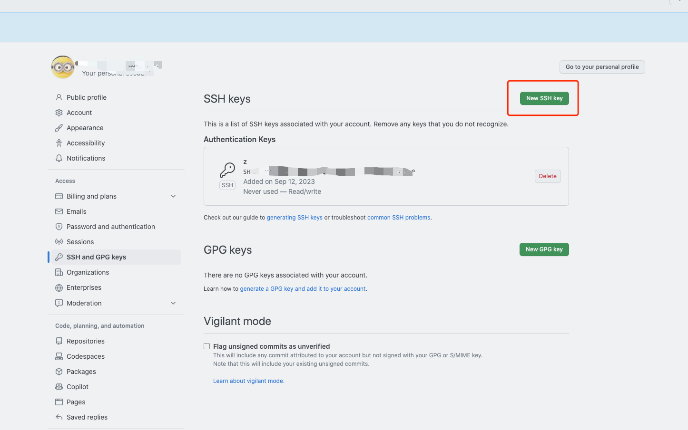
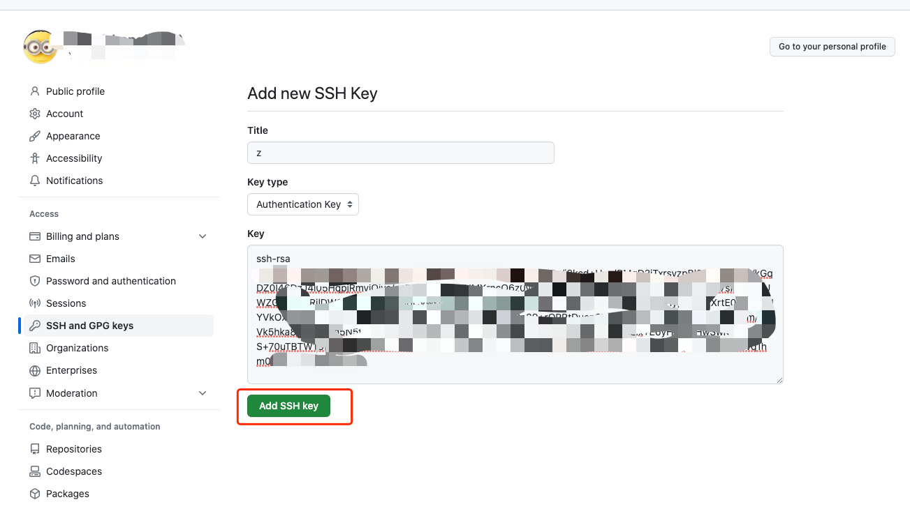

# 问题解决“Please make sure you have the correct access rights and the repository exists.”

## 重新生成id_rsa
#### 1. 设置用户名和邮箱
```shell
git config --global user.name '张大嘴'

git config --global user.email 'zhangdz@gmail.com'

git config --list
```
#### 2. 重新生成秘钥
```shell
ssh-keygen -t rsa -C "zhangdz@gmail.com"
```
## 拷贝命令
```shell
pbcopy < ~/.ssh/id_rsa.pub 
```

## GitHub添加ssh秘钥


## 测试SSH链接
```shell
$ ssh -T git@github.com
```

