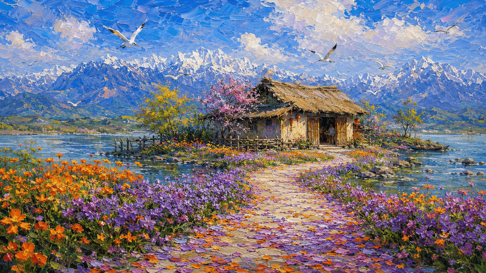

  
  <!-- 左侧：诗文部分 -->
  

    <h1 style="font-weight: normal; margin-bottom: 15px; color: #2c2c2c; font-size: 32px;">《 客 至 》</h1>
    

      作者：杜甫
    

    

      舍南舍北皆春水，但见群鸥日日来。 
      花径不曾缘客扫，蓬门今始为君开。 
      盘飧市远无兼味，樽酒家贫只旧醅。 
      肯与邻翁相对饮，隔篱呼取尽馀杯。
    

  

  <!-- 右侧：风景画 -->
  

    
  

