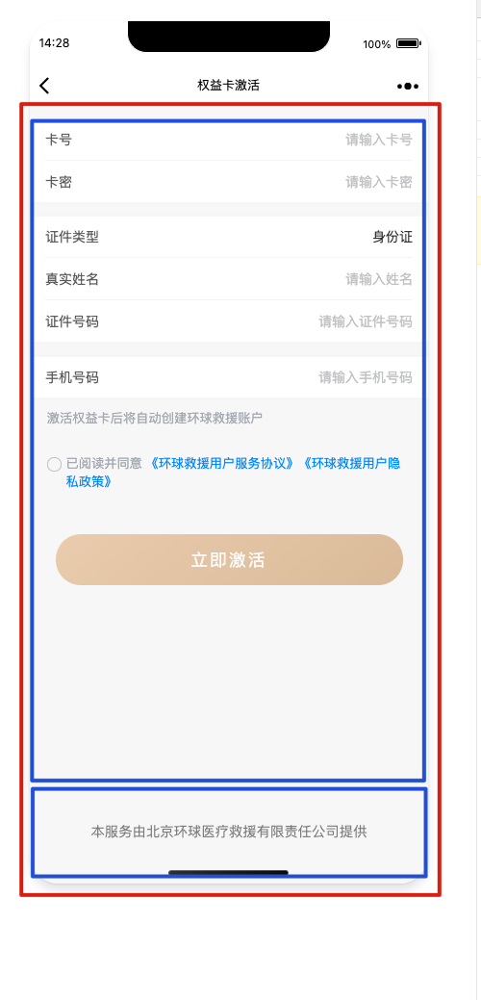

# 页尾固定在底部(fixed在安卓设备会上漂)

1. 背景:
2. - 在webview上开发页面时页面底部有固定文案(页尾)
    - 页尾用fixed固定在底部,如果当前页面有输入框,安卓设备,用户在输入时页尾会跟随键盘向上移
3. 解决办法
4. 利用flex布局和其内部元素的flex-grow与flex-shrink属性
5. 布局 
   - 
6. 外层 div
    - - display: flex;
        - flex-direction: column;
        - min-height: 100%; (或者 min-height 100vh)
    - 内层1 - 内容区 content
    - - flex: 1;
        - overflow-y: auto;
    - 内层2 - 底部 footer
    - - flex-shrink: 0;
     - position sticky (后来添加)
     - bottom 0 (后来添加)
7. 说明
8. - 外层div使用flex布局,竖向,最小高度100%
    - 内容区使用flex: 1;  相当于flex-grow: 1; 代表扩展以填充空白部分
    - 底部页尾使用flex-shrink: 0; 代表保持内容大小
    - - `flex: 1;` 是一个CSS缩写属性，它用于设置一个项目的弹性伸缩能力，相关的属性包括 `flex-grow`, `flex-shrink`, 和 `flex-basis`。
        - 它的含义是将项目的弹性因子设置为1，也就是说，当容器剩余空间时，该项目将尽可能地扩展以填充空白部分，同时将收缩到适合容器的大小。
        - `flex-grow`属性控制项目在分配容器空间方面的增长程度；
        - `flex-shrink`属性控制项目在空间不足时的缩小程度；
        - `flex-basis`属性定义项目在主轴方向上的基准大小。
        - 而 `flex: 1;` 相当于设置了 `flex-grow: 1; flex-shrink: 1; flex-basis: 0%;`。
        - 也就是说，它告诉浏览器，将该项目的剩余空间等分给其他具有相同属性的项目。
