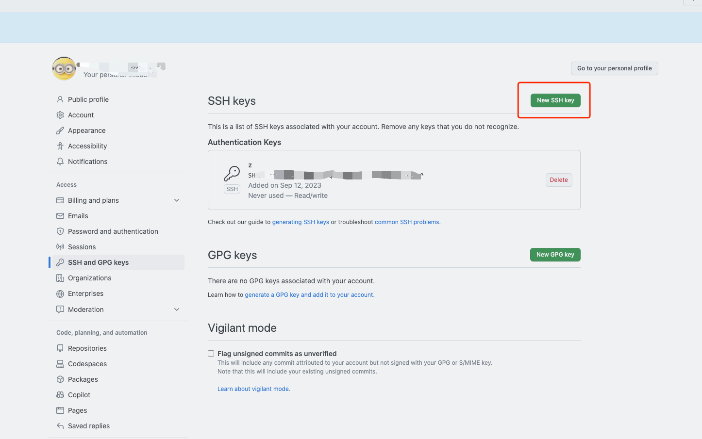
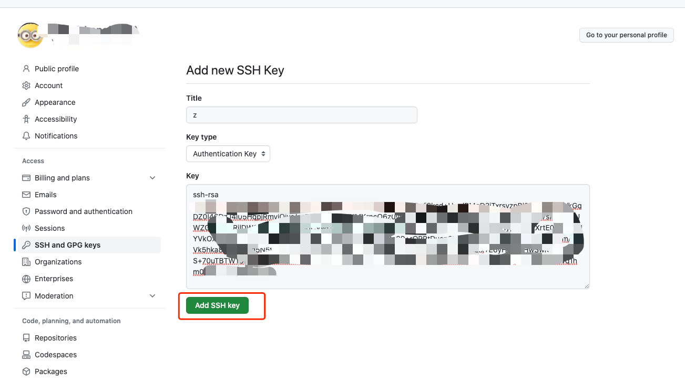
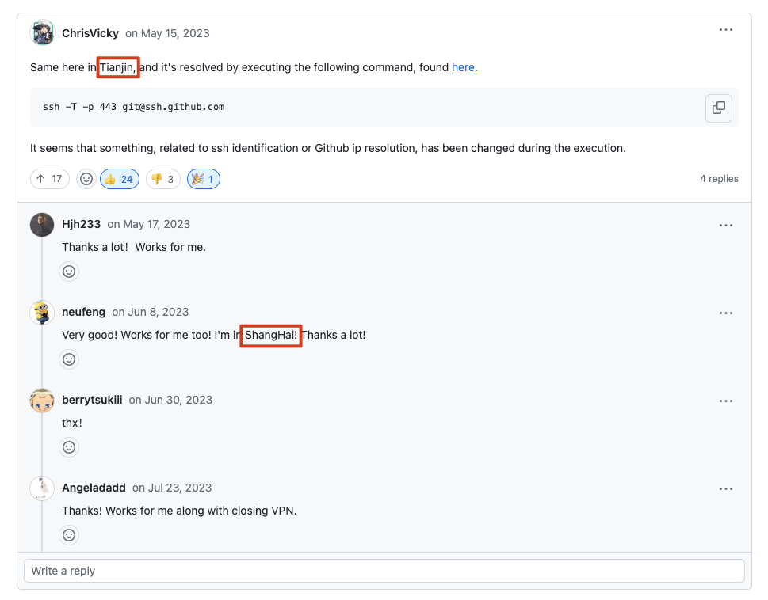

# 问题解决“Please make sure you have the correct access rights and the repository exists.”

## 重新生成id_rsa
[GitHub文档-生成新 SSH 密钥](https://docs.github.com/zh/authentication/connecting-to-github-with-ssh/generating-a-new-ssh-key-and-adding-it-to-the-ssh-agent)
#### 1. 设置用户名和邮箱
```shell
git config --global user.name '张大嘴'

git config --global user.email 'zhangdz@gmail.com'

git config --list
```
#### 2. 重新生成秘钥
```shell
ssh-keygen -t rsa -C "zhangdz@gmail.com"
```
## 拷贝命令
```shell
pbcopy < ~/.ssh/id_rsa.pub 
```

Windows 打开 PowerShell

```sh
cat ~\.ssh\id_rsa.pub | clip
```


## GitHub添加ssh秘钥



## [GitHub文档-测试SSH链接](https://docs.github.com/zh/authentication/connecting-to-github-with-ssh/testing-your-ssh-connection)
```shell
ssh -T git@github.com
```


### 如果问题依旧出现请 => [参考链接](https://github.com/orgs/community/discussions/55269#discussioncomment-5901007)

> Same here in Tianjin, and it's resolved by executing the following command, found [here](https://docs.github.com/en/authentication/troubleshooting-ssh/using-ssh-over-the-https-port).
>
> ```shell
> ssh -T -p 443 git@ssh.github.com
> ```
>
> It seems that something, related to ssh identification or Github ip resolution, has been changed during the execution.


