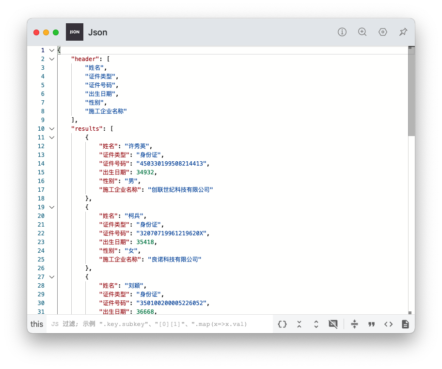

# 导入和导出Excel文件

参考链接

[Vue中实现Excel导入与导出功能（核心代码）](https://juejin.cn/post/7022968195573088263)

[vue-element-admin Excel导入和导出](https://panjiachen.github.io/vue-element-admin-site/zh/feature/component/excel.html)

[导出demoe](https://panjiachen.github.io/vue-element-admin/#/excel/export-excel)

[导出demo代码](https://github.com/PanJiaChen/vue-element-admin/blob/master/src/views/excel/export-excel.vue)

[参考导入Excel的vue组件](https://github.com/PanJiaChen/vue-element-admin/blob/master/src/components/UploadExcel/index.vue)


### 1. 导入(improt)

1. 安装工具 → 封装选择Excel文件方法 → 封装读取Excel文件方法 → 调用 → 组装需要的数据格式 → 渲染到页面

2. 依赖工具`XLSX`

    - ```sh
        npm install xlsx -S
        ```

3. 封装选择和读取Excel文件模块

    ```JS
    import * as XLSX from 'xlsx'
    import { formatDate } from 'common/utils'
    
    let fileInput = null
    function getFile() {
        return new Promise((resolve, reject) => {
            if (fileInput) {
                document.body.removeChild(fileInput)
                fileInput = null
            }
            fileInput = document.createElement('input')
            fileInput.type = 'file'
            const styles = {
                position: 'absolute',
                visibility: 'hidden',
                'z-index': -9999,
                width: 0,
                height: 0,
                top: 0,
                left: 0
            }
            for (const attrName in styles) {
                fileInput.style[attrName] = styles[attrName]
            }
            document.body.appendChild(fileInput)
            fileInput.addEventListener('change', function (e) {
                const files = e.target.files
                const rawFile = files[0]
                fileInput.value = null
                if (rawFile) {
                    document.body.removeChild(fileInput)
                    fileInput = null
                    resolve(rawFile)
                } else {
                    reject()
                }
            })
            fileInput.accept = '.xlsx,.xls'
            fileInput.click()
        })
    }
    
    function getHeaderRow(sheet) {
        const headers = []
        const range = XLSX.utils.decode_range(sheet['!ref'])
        let C
        const R = range.s.r
        /* start in the first row */
        for (C = range.s.c; C <= range.e.c; ++C) { /* walk every column in the range */
            const cell = sheet[XLSX.utils.encode_cell({ c: C, r: R })]
            /* find the cell in the first row */
            let hdr = 'UNKNOWN ' + C // <-- replace with your desired default
            if (cell && cell.t) hdr = XLSX.utils.format_cell(cell)
            headers.push(hdr)
        }
        return headers
    }
    function readData(rawFile) {
        return new Promise((resolve, reject) => {
            const reader = new FileReader()
            reader.onload = e => {
                const data = e.target.result
                const workbook = XLSX.read(data, {type: 'array'})
                const firstSheetName = workbook.SheetNames[0]
                const worksheet = workbook.Sheets[firstSheetName]
                const header = getHeaderRow(worksheet)
                const results = XLSX.utils.sheet_to_json(worksheet)
                resolve({header,results})
            }
            reader.readAsArrayBuffer(rawFile)
        })
    }
    
    function importExcel() {
        return new Promise(async (resolve, reject) => {
            try {
                resolve(await readData(await getFile()))
            } catch (e) {
                reject()
            }
        })
    }
    
    /**
     * 日期数字转日期格式
     * 这是因为Excel中的日期值是从1900年1月1日开始计算的，而JavaScript中的时间戳是从1970年1月1日开始计算的。
    * */
    function formatExcelDate(excelDate, format='yyyy-MM-dd') {
        return formatDate(new Date((excelDate - 25569) * 86400 * 1000), format)
    }
    export {
        importExcel,
        formatExcelDate
    }
    ```

    

4. 调用

    - ```JS
        import { importExcel } from 'common/ImportExcel'
        async uploadExcel() {
               const data = await importExcel()
               console.log('@@ ---- data:',data)
        }
        ```

    - 结果 (数据均为mock数据!)

    - 出生日期为Excel数字,需要处理 `new Date((excelDate - 25569) * 86400 * 1000`

    - ```JS
        // 这是因为Excel中的日期值是从1900年1月1日开始计算的，
        // 而JavaScript中的时间戳是从1970年1月1日开始计算的。
        function formatExcelDate(excelDate, format='yyyy-MM-dd') {
            return formatDate(new Date((excelDate - 25569) * 86400 * 1000), format)
        }
        ```

        

### 2. 导出(export)

1. 安装依赖工具 → 获取页面表格数据 → 组装导出工具的数据格式 → 工具导出

2. 安装依赖包

    - Export2Excel.js依赖 js-xlsx,file-saver,script-loader

    - ```sh
        npm install xlsx file-saver -S
        npm install script-loader -S -D
        ```

3. 下载[Export2Excel.js](https://github.com/PanJiaChen/vue-element-admin/blob/master/src/vendor/Export2Excel.js)

    - 放入/src/common/Export2Excel.js  (只要能引用,哪里都可以)

4. 使用

    - ```js
        import('@/common/Export2Excel').then(excel => {
          excel.export_json_to_excel({
            header: tHeader, //表头 必填
            data, //具体数据 必填
            filename: 'excel-list', //非必填
            autoWidth: true, //非必填
            bookType: 'xlsx' //非必填
          })
        })
        ```

    - 我代码里的使用方法

    - ```js
        async export2Excel() {
                    try {
                        const {data: {records = []}} = await batchOrderListApi({
                            pageSize: this.orderDetailTotal,
                            pageNum: 1,
                            wageDetailId: this.orderDetail.wageDetailId
                        })
                        const header = ['订单编号','产品名称','产品类型','供应商名称','保单号','投保人','保费（元）','收入（元）','保单状态','结算状态','出单日期','合作模式','团队名称','团队编码','渠道名称','渠道编码']
                        const filterVal = ['orderId', 'proName', 'proType','insCompanyName','policyNo','holderName','premium','wageAmount','policyStatusName','wageSettleStatusName','createDate','modeName','channelGroupName','channelGroupCode','channelName','channelId']
                        const data = records.map(item => filterVal.map(key => item[key]))
                        const channelName = this.orderDetail.channelName;
                        const date = formatDate(new Date(), 'yyyyMMdd');
                        const filename = `结算导出-订单明细-${channelName}-${date}`
                        const excel = await import('@/common/Export2Excel')
                        excel.export_json_to_excel({
                            header, //表头 必填
                            data, //具体数据 必填
                            filename, //非必填
                        })
                    } catch (error) {
                        console.log('@@ ---- error:',error)
                        this.$message.error(`导出数据失败:${JSON.stringify(error)}`)
                    }
                }
        ```

5. 注意点:

    - 如果提示语法错误 `SyntaxError: The requested module '/node_modules/.vite/deps/xlsx.js?v=fec8f23c' does not provide an export named 'default' (at Export2Excel.js:4:8)`

    - export2Excel.js文件中如下修改

    - ```JS
        // import XLSX from 'xlsx'
        import * as XLSX from 'xlsx
        ```