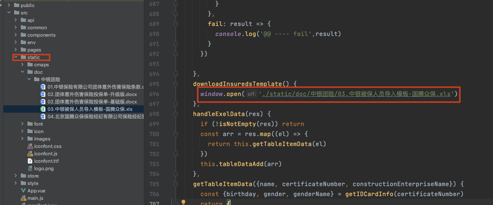

# uniapp静态目录和引用(坑)

## 静态目录

在src/static

[目录结构](https://uniapp.dcloud.net.cn/tutorial/project.html#%E7%9B%AE%E5%BD%95%E7%BB%93%E6%9E%84)

```
┌─uniCloud              云空间目录，阿里云为uniCloud-aliyun,腾讯云为uniCloud-tcb（详见uniCloud）
│─components            符合vue组件规范的uni-app组件目录
│  └─comp-a.vue         可复用的a组件
├─utssdk                存放uts文件
├─pages                 业务页面文件存放的目录
│  ├─index
│  │  └─index.vue       index页面
│  └─list
│     └─list.vue        list页面
├─static                存放应用引用的本地静态资源（如图片、视频等）的目录，注意：静态资源只能存放于此
├─uni_modules           存放[uni_module](/uni_modules)。
├─platforms             存放各平台专用页面的目录，详见
├─nativeplugins         App原生语言插件 详见
├─nativeResources       App端原生资源目录
│  ├─android            Android原生资源目录 详见
|  └─ios                iOS原生资源目录 详见
├─hybrid                App端存放本地html文件的目录，详见
├─wxcomponents          存放小程序组件的目录，详见
├─unpackage             非工程代码，一般存放运行或发行的编译结果
├─AndroidManifest.xml   Android原生应用清单文件 详见
├─Info.plist            iOS原生应用配置文件 详见
├─main.js               Vue初始化入口文件
├─App.vue               应用配置，用来配置App全局样式以及监听 应用生命周期
├─manifest.json         配置应用名称、appid、logo、版本等打包信息，详见
├─pages.json            配置页面路由、导航条、选项卡等页面类信息，详见
└─uni.scss              这里是uni-app内置的常用样式变量
	
```

> static目录不会编译,会直接放到最终打包目录

## 引用静态资源

[引用静态资源](https://zh.uniapp.dcloud.io/tutorial/page-static-assets.html)

```html
<!-- 绝对路径，/static指根目录下的static目录，在cli项目中/static指src目录下的static目录 -->
<image class="logo" src="/static/logo.png"></image>
<image class="logo" src="@/static/logo.png"></image>
<!-- 相对路径 -->
<image class="logo" src="../../static/logo.png"></image>
```


## 注意点:相对路径配置

在manifest.json文件中

[h5-router](https://zh.uniapp.dcloud.io/collocation/manifest.html#h5-router)

#### router

| 属性 | 类型   | 默认值 | 说明                                                         |
| :--- | :----- | :----- | :----------------------------------------------------------- |
| mode | String | hash   | 路由跳转模式，支持 hash、history                             |
| base | String | /      | 应用基础路径，例如，如果整个单页应用服务在 /app/ 下，然后 base 就应该设为 "/app/"，支持设置为相对路径 "./" |

**注意：**

- `history` 模式部分浏览器器不支持，iOS微信内置浏览器无法观测到URL变动，默认分享（不使用微信[JSSDK](https://ask.dcloud.net.cn/article/35380)的情况下）的链接为入口页链接。
- `history` 模式发行需要后台配置支持，详见：[history 模式的后端配置](https://router.vuejs.org/zh/guide/essentials/history-mode.html#后端配置例子)


在当前项目中配置如下,配置为 `"base": "./"` 使用的是相对HTML页面的路径

```json
"h5": {
		"title": "众保云",
		"template": "public/index.html",
		"router": {
			"base": "./",
			"mode": "hash"
		},
```

在项目中引用方式,注意是用 `./static/...`

```js
window.open('./static/doc/中银团险/03.中银被保人员导入模板-国腾众保.xls')
```



## 其他注意点:

如果不清楚上面的配置,会去研究`vue.config.js`配置文件中publicPath,`但是不会生效`

[uniapp的vue.config.js配置注意事项](https://zh.uniapp.dcloud.io/collocation/vue-config.html#)

**注意事项**

- 仅vue页面生效

部分配置项会被编译配置覆盖，例如：

- publicPath 不支持，如果需要配置，请在 manifest.json->h5->router->base 中配置，参考文档：[h5-router](https://zh.uniapp.dcloud.io/collocation/manifest#h5-router)
- outputDir 不支持
- assetsDir 固定 static
- pages 不支持
- runtimeCompiler 固定 false
- productionSourceMap 固定 false
- css.extract H5 平台固定 false，其他平台固定 true
- parallel 固定 false
- 使用cli项目时，默认情况下 babel-loader 会忽略所有 node_modules 中的文件。如果你想要通过 Babel 显式转译一个依赖，可以在transpileDependencies中列出来。[详情参考](https://cli.vuejs.org/zh/config/#transpiledependencies)


根据上面的第一点,推出在下面 `module.exports`中配置 `publicPath`不会生效

```js
modules.exports = {
    publicPath: './'
}
```

### publicPath[#](https://cli.vuejs.org/zh/config/#publicpath)

- Type: `string`

- Default: `'/'`

    部署应用包时的基本 URL。用法和 webpack 本身的 `output.publicPath` 一致，但是 Vue CLI 在一些其他地方也需要用到这个值，所以**请始终使用 `publicPath` 而不要直接修改 webpack 的 `output.publicPath`**。

    默认情况下，Vue CLI 会假设你的应用是被部署在一个域名的根路径上，例如 `https://www.my-app.com/`。如果应用被部署在一个子路径上，你就需要用这个选项指定这个子路径。例如，如果你的应用被部署在 `https://www.my-app.com/my-app/`，则设置 `publicPath` 为 `/my-app/`。

    这个值也可以被设置为空字符串 (`''`) 或是相对路径 (`'./'`)，这样所有的资源都会被链接为相对路径，这样打出来的包可以被部署在任意路径，也可以用在类似 Cordova hybrid 应用的文件系统中。

    相对 publicPath 的限制

    相对路径的 `publicPath` 有一些使用上的限制。在以下情况下，应当避免使用相对 `publicPath`:

    - 当使用基于 HTML5 `history.pushState` 的路由时；
    - 当使用 `pages` 选项构建多页面应用时。

    这个值在开发环境下同样生效。如果你想把开发服务器架设在根路径，你可以使用一个条件式的值：

    ```js
    module.exports = {
      publicPath: process.env.NODE_ENV === 'production'
        ? '/production-sub-path/'
        : '/'
    }
    ```