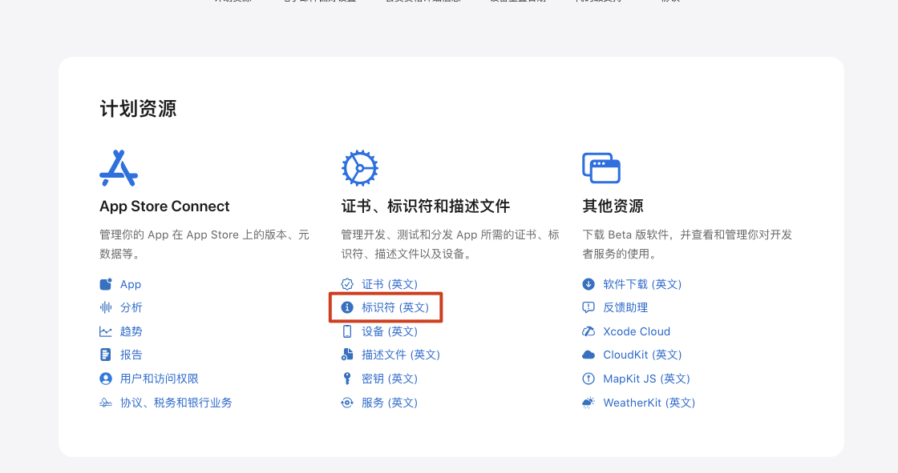
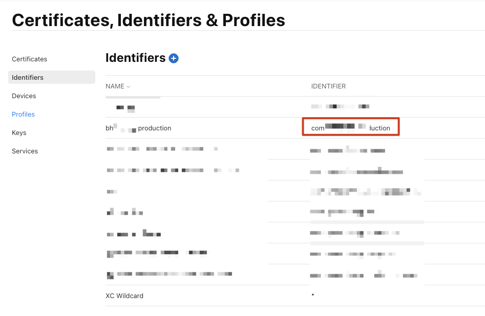
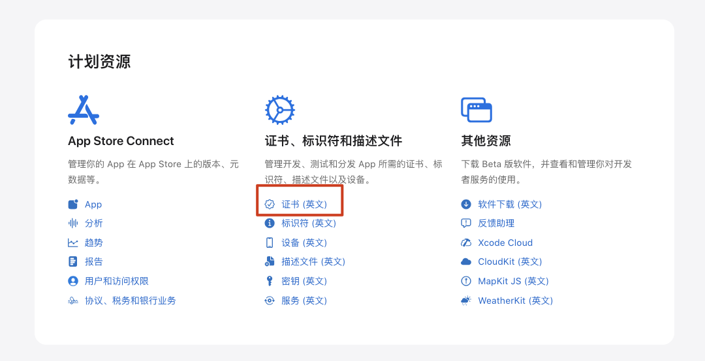
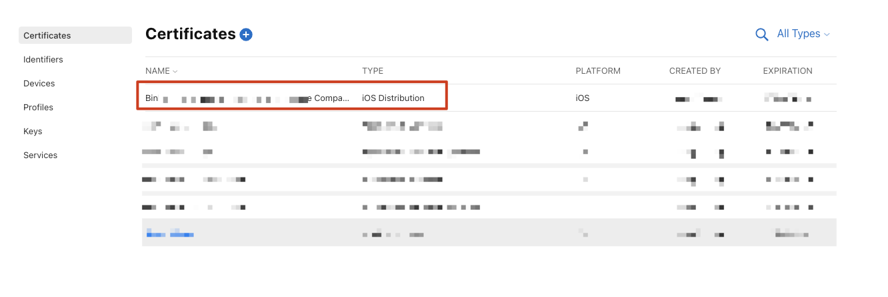
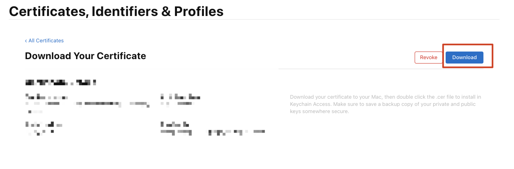
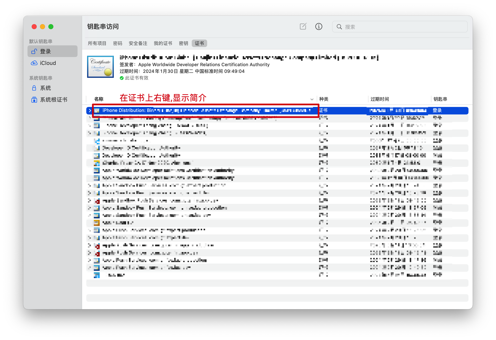
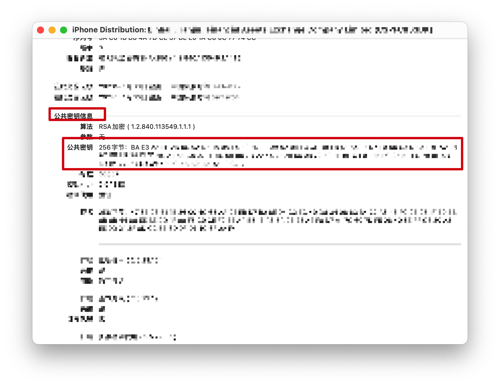
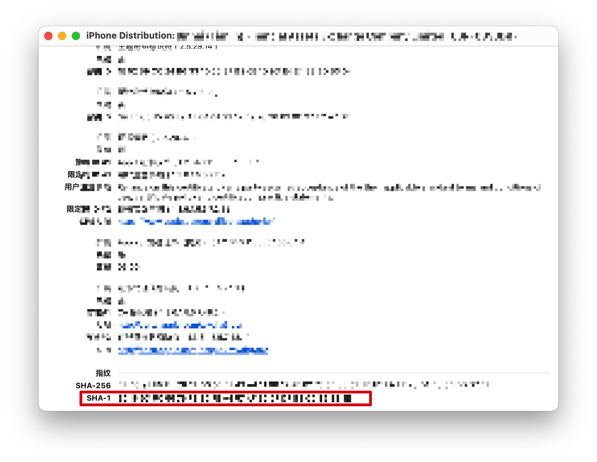
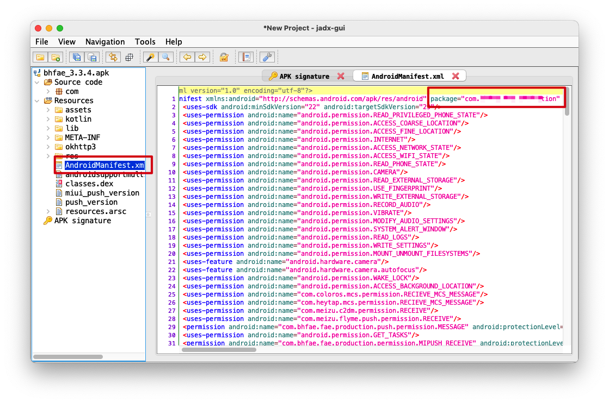
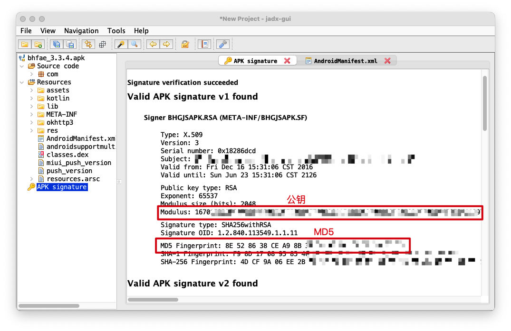

# 获取App特征信息(App备案)

## App特征信息说明

| 特征信息              | 说明                                                         |
| --------------------- | ------------------------------------------------------------ |
| （安卓 Android）包名  | APP 包名是一个应用程序的唯一标识符。包名通常以反向域名的形式定义，例如：com.apple.myapp。 |
| （苹果 iOS）Bundle ID | （苹果 iOS）Bundle IDBundle ID是 IOS 应用程序的唯一标识符，它类似于 Android 应用程序的包名。它由一串由点分隔的字符串组成，例如：com.apple.myapp。 |
| 平台公钥              | 平台公钥是一种加密算法中的公钥，用于保护数据的安全性。在移动应用程序中，平台公钥通常用于验证应用程序的数字签名，以确保应用程序的完整性和真实性。 |
| 签名 MD5 值           | 签名 MD5 值是指应用程序在发布到应用商店之前，由开发者使用签名证书对应用程序进行数字签名后所得到的 MD5 值。<br />APP 特征信息中的 MD5 值，指的是 APP 证书的数字指纹值。<br />安卓版 APP：请填写证书的 MD5 值（以16进制形式填写）。<br />苹果版 APP：请填写证书的 SHA-1 值（以16进制形式填写）。 |


## iOS平台

- 获取Bundle ID 公共秘钥 指纹(SHA-1)
- 访问 https://developer.apple.com/account
- 获取 bundle Id
    - 
    - 
- 获取秘钥与指纹
    - 
    - 
    - 
    - 下载后双击,右键显示简介
    - 
    - 
    - MD5值(SHA-1)
    - 


## Android平台

- 安装jadx

    - ```shell
        brew install jadx
        ```

    - 如果遇到失败

        - > tar: Error opening archive: Failed to open '/Users/xxx/Library/Caches/Homebrew/downloads

        - ```sh
            # 更改为默认的下载源
            unset HOMEBREW_BOTTLE_DOMAIN
            ```

        - 然后重新安装即可

- 安装完成后打开

    - ```sh
        jadx-gui
        ```

- 选择目标apk

- 查看包名

    - 

- 查看公钥和MD5

    - 

