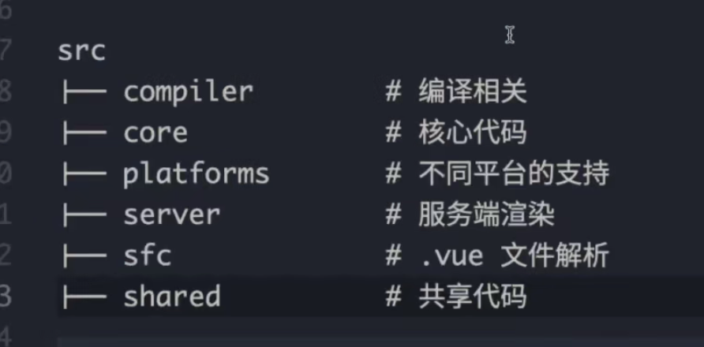
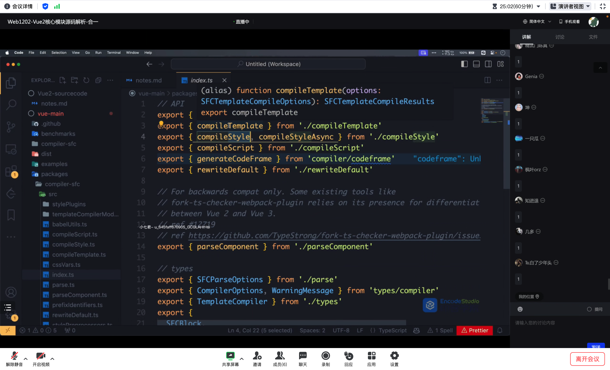
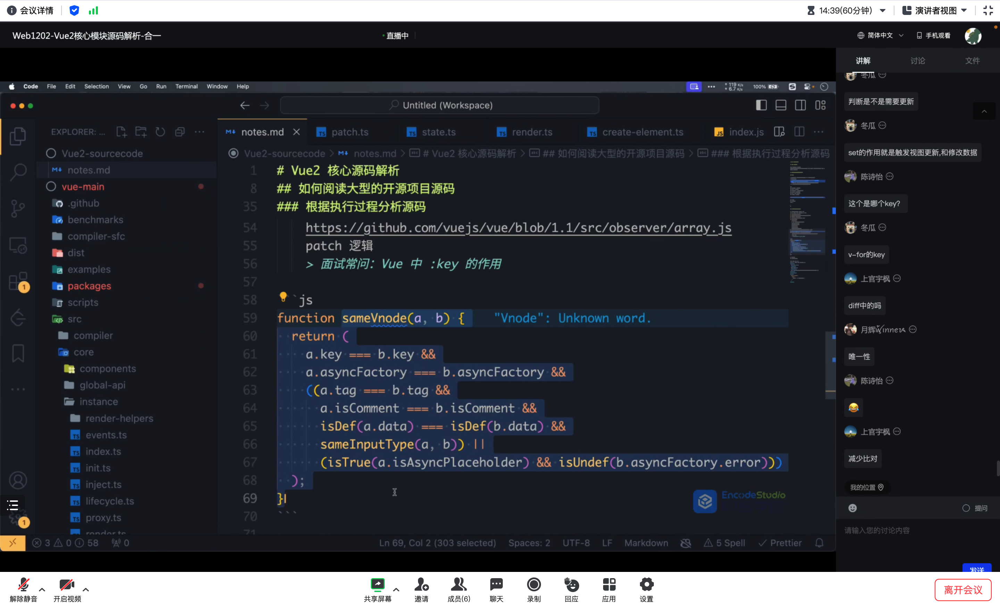
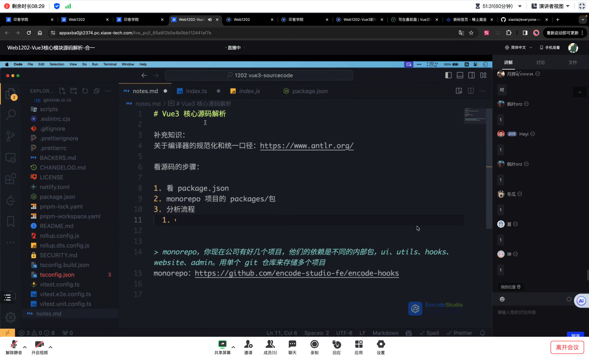
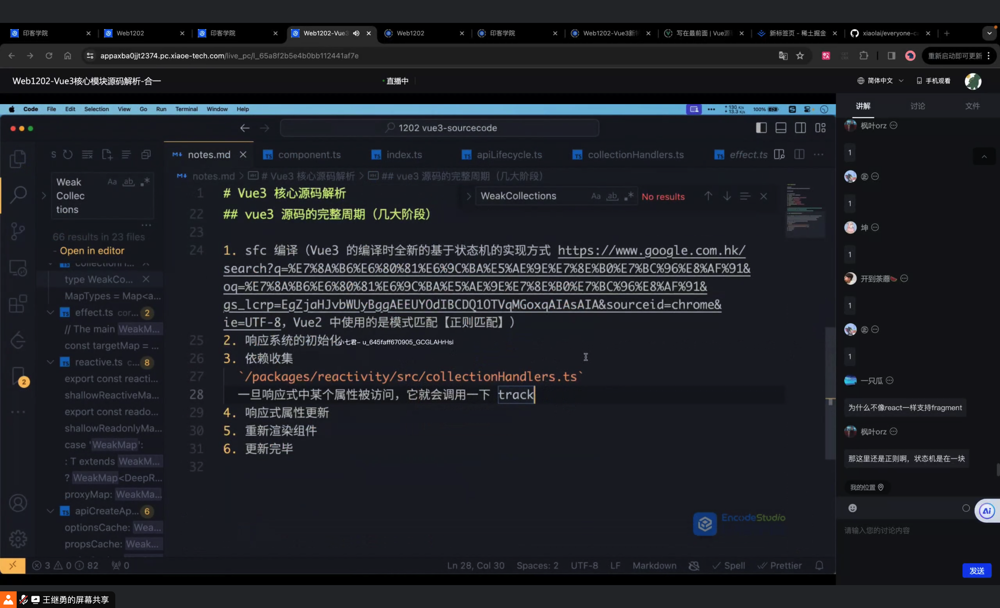
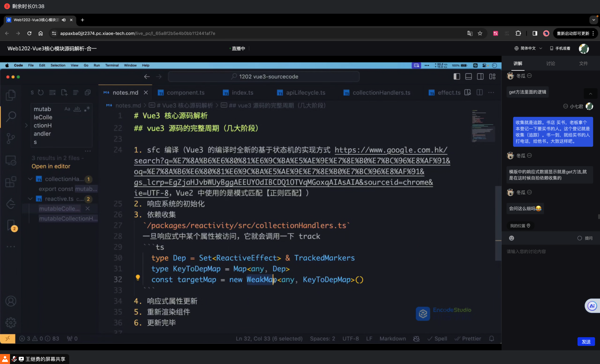

# Vue2 核心源码解析

## Flow相关内容

- 类比ts就可以了
- 然后就可以稍微料及一下为什么当时选择Flow而不是ts,为什么Vue3完全拥抱TS

## 如何阅读大型开源项目源码

### 思路

- 了解核心流程API,首先可定要库的API用熟(顺藤摸瓜)
- 执行整体流程
    - webpack/vite/gulp: 从启动到打包完成输出
        - 一些不用看,非常老旧的: yeoman/grunt/rollup/esbuild/swc/turbopack/rspack
    - Vue2: Vue2应用从初始化到挂载到触发更新的整个流程
    - 

- 看package.json依赖了哪些包,还有哪些命令

- lodash, underscore, ramda(有名的工具库,但是没有太多的学习参考意义)

- ```vue
    new Vue({
    	id: '#fff',
    	data: {}
    })
    ```

- ```html
    // SFC single file component
    <template>
    <style>
    <script>
    ```

### 根据执行过程分析源码

- 首先我们编写的是xxx.vue文件
- sfc用来讲.vue文件转换为js文件
    - packages/compiler-sfc/src/index.ts
    - 
    - compileTemplate,compileStyle,compileScript
- compiler 用于编译处理
    - 内容太多,跳过
- 启动项目,初始化应用,new vue()
    - /src/core/index.ts
    - initGlobalAPI(Vue)
        - initUse(Vue) // Vue 插件化机制的初始化逻辑
            - 例如: Vue.use(ElementUI)
        - initMixin(Vue) // this.options = mergeOptions() 
        - initExtend(Vue)
        - initAssetRegisters(Vue)
- 处理一些初始化的逻辑,包含生命周期,mixin等内容
- 创建vdom,挂载
    - core/instance/render.ts
- 一旦发生更新(data数据变更,通过监听触发)
    - 面试常问: Vue中ke的做key
    - vue响应式系统中,大量源码在做性能优化,其中包含key,在diff过程中,我们只使用尝试花最小代价最大程度进行节点复用,而key就作为我们判断节点是否可以复用的一个标准.
    - 
    - 装逼: 在core/vdom/path.ts 36行 sameVnode(a,b){...}
    - Vue2 源码：https://vue-js.com/learn-vue/start/
- 收集依赖
- 处理更新,diff


# Vue3 核心源码解析


使用vue3 v3.3.4

https://github.com/vuejs/core/tree/v3.3.4


monorepo: 你现在公司有好几个项目,他们的依赖是不同的内部报,ui,utils,hooks,website,admin.用单个git仓库来存贮多个项目

monorepo: https://github.com/encode-studio-fe/encode-hooks



看源码的步骤:

- 看package.json
- monorepo项目的packages/包
- 分析流程
    - xxx.vue 文件经过编译 **compiler-sfc**
    - 应用初始化          **runtime-core**
    - 组件挂载  **runtime-core**
    - 数据的响应式处理 **reactive**
    - 触发数据更新
    - 将数据更新同步到视图


```
Vue3 源码实现
https://www.alipan.com/s/nA2SsWpnxpS
提取码: 5e5d
点击链接保存，或者复制本段内容，打开「阿里云盘」APP ，无需下载极速在线查看，视频原画倍速播放。
```


## Vue3源码的完整周期

- sfc编译 (Vue3的变异是基于状态机的视线方式. Vue2种使用的是正则匹配)
    - 状态机
- 相应系统的初始化
- 收集依赖
    - packages/reactivity/src/collectionHandlers.ts
    - 
    - 
- 响应式属性更新
- 重新渲染组件
- 更新完毕


