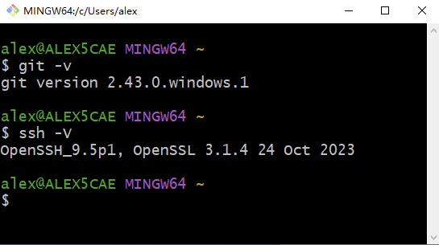
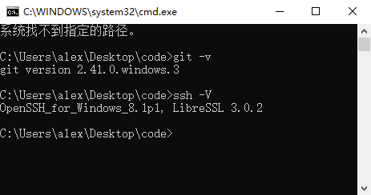
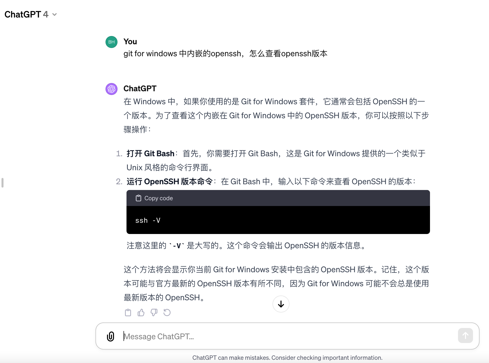

# macOS venture和Windows的ssh无法访问git服务器,解决permission denied问题


## 1. SmartGit能clone代码,但是终端提示permission denied

这里只挑重点记录.

在Windows中打开power shell终端,rsa创建公私钥,一路回车

```sh
ssh-keygen -t rsa -C "your_email@example.com"
```

把创建好是rsa公钥添加到服务器的ssh key中,然后本地使用SmartGit客户端clone代码,发现能正常使用(具体操作略过)

**但是,在git for Windows 的 git bash终端中就无法使用,一直提示permission denied**

后来发现是算法问题,需使用ed25519算法

```sh
ssh-keygen -t ed25519 -C "your_email@example.com"
```

把生成的**id_ed25519.pub**放入服务器的ssh key 中,再次使用终端就可以clone代码了


## 2. 原因

[参考GitHub文档 生成新SSH密钥](https://docs.github.com/zh/authentication/connecting-to-github-with-ssh/generating-a-new-ssh-key-and-adding-it-to-the-ssh-agent?platform=windows#generating-a-new-ssh-key)

可在本地计算机上生成新的 SSH 密钥。 生成密钥后，可将公钥添加到 GitHub.com 上的帐户中，以便通过 SSH 为 Git 操作启用身份验证。

注意：GitHub 通过在 2022 年 3 月 15 日删除旧的、不安全的密钥类型来提高安全性。

自该日期起，不再支持 DSA 密钥 (`ssh-dss`)。 无法在 GitHub.com上向个人帐户添加新的 DSA 密钥。

2021 年 11 月 2 日之前带有 `valid_after` 的 RSA 密钥 (`ssh-rsa`) 可以继续使用任何签名算法。 在该日期之后生成的 RSA 密钥必须使用 SHA-2 签名算法。 一些较旧的客户端可能需要升级才能使用 SHA-2 签名。

1. 打开Git Bash。

2. 粘贴以下文本，将示例中使用的电子邮件替换为 GitHub 电子邮件地址。

    ```shell
    ssh-keygen -t ed25519 -C "your_email@example.com"
    ```

    注意：如果你使用的是不支持 Ed25519 算法的旧系统，请使用以下命令：

    ```shell
     ssh-keygen -t rsa -b 4096 -C "your_email@example.com"
    ```

    这将以提供的电子邮件地址为标签创建新 SSH 密钥。

    ```shell
    > Generating public/private ALGORITHM key pair.
    ```

    当系统提示您“Enter a file in which to save the key（输入要保存密钥的文件）”时，可以按 Enter 键接受默认文件位置。 请注意，如果以前创建了 SSH 密钥，则 ssh-keygen 可能会要求重写另一个密钥，在这种情况下，我们建议创建自定义命名的 SSH 密钥。 为此，请键入默认文件位置，并将 id_ALGORITHM 替换为自定义密钥名称。

    ```powershell
    > Enter a file in which to save the key (c:\Users\YOU\.ssh\id_ALGORITHM):[Press enter]
    ```

3. 在提示符下，键入安全密码。 有关详细信息，请参阅“[使用 SSH 密钥密码](https://docs.github.com/zh/authentication/connecting-to-github-with-ssh/working-with-ssh-key-passphrases)”。

    ```shell
    > Enter passphrase (empty for no passphrase): [Type a passphrase]
    > Enter same passphrase again: [Type passphrase again]
    ```

## 3. 为什么SmartGit可以,终端不可以

2021年09月26日发布的OpenSSH 8.8中移除了对RSA-SHA1的支持

> 最新的git for windows 2.33.1版本已使用OpenSSH 8.8
> arch和manjaro等发行版的滚动升级比较激进，使用pacman -Syu就会升级所有软件到最新版本
> 此时的表现就是之前还可以正常使用，pacman -Syu或升级到git for windows 2.33.1之后使用git pull就出现fatal: 无法读取远程仓库的提示
> 如果您升级到OpenSSH 8.8或以上版本，则使用ssh推拉Gitee代码时会出现校验不通过的问题


git bash终端自带的openSSH版本为9.5,高于8.8所以会出现该问题,截图如下



SmartGit自带的openSSH版本为8.1,低于8.8,所以该问题不会出现,截图如下 (SmartGit->工具->Open in Terminal)





## 4. 解决办法

- 延用原RSA,配置OpenSSH服务允许使用RSA-SHA1key

    - > 在 ~/.ssh/config 加上如下配置 Host xxx
        >
        > HostkeyAlgorithms +ssh-rsa  PubkeyAcceptedAlgorithms +ssh-rsa

- 换 ed25519 生成ssh key

    - ```sh
        ssh-keygen -t ed25519 -C "your@example.email"
        ```

        

## 5. 解决 macOS Ventura 使用 ssh、git 等无法正常使用的问题

> [参考链接](https://likfe.com/2022/10/25/ventura-ssh-error/)
>
> 升级到 macOS Ventura 后，无法使用 SSH 命令登入服务器，开启日志后，可能会看到 `no matching host key type found` 的报错信息。
> 如果是使用了基于 SSH 协议的相关指令，也会发生错误。比如使用 `git clone` 、`git pull` 等去同步基于 SSH 地址的 git 仓库代码时，会提示 `Permission denied (publickey) `。
>
> 经过查证，macOS Ventura 内置使用了 OpenSSH_9.0p1，根据 [OpenSSH 发行说明](https://www.openssh.com/releasenotes.html) 可以得知，从 OpenSSH 8.8/8.8p1 版本开始，就默认关闭了 ssh-rsa 算法。那么 macOS Ventura 内置使用的 OpenSSH_9.0p1 也是默认关闭了 ssh-rsa 算法。
>
> ```
> OpenSSH 8.8/8.8p1 (2021-09-26)
> Incompatibility is more likely when connecting to older SSH
> implementations that have not been upgraded or have not closely tracked
> improvements in the SSH protocol. For these cases, it may be necessary
> to selectively re-enable RSA/SHA1 to allow connection and/or user
> authentication via the HostkeyAlgorithms and PubkeyAcceptedAlgorithms
> options. For example, the following stanza in ~/.ssh/config will enable
> RSA/SHA1 for host and user authentication for a single destination host:
> 
>     Host old-host
>         HostkeyAlgorithms +ssh-rsa
>         PubkeyAcceptedAlgorithms +ssh-rsa
> 
> We recommend enabling RSA/SHA1 only as a stopgap measure until legacy
> implementations can be upgraded or reconfigured with another key type
> (such as ECDSA or Ed25519).
> 
> OpenSSH 8.7/8.7p1 (2021-08-20)
> OpenSSH will disable the ssh-rsa signature scheme by default in the
> next release.
> ```
>
> 解决办法:
>
> - 重新生成 ed25519 算法的密钥
>
>     - 
>
>     - ```
>         ssh-keygen -t ed25519
>         ```
>
> - 重新启用 RSA/SHA1
>
>     - ```	
>         # 在 ~/.ssh/config 文件的对应主机配置里新增2行：
>         Host xxx-host
>             HostkeyAlgorithms +ssh-rsa
>             PubkeyAcceptedAlgorithms +ssh-rsa
>         ```
>
>     - 全部场景
>
>     - 
>
>     - ```
>         # 配置里有 Host * 配置的，需要写到 Host * 内
>         Host *
>         	HostkeyAlgorithms +ssh-rsa
>         	PubkeyAcceptedAlgorithms +ssh-rsa
>         # 没有的，在 ~/.ssh/config 文件的顶部插入或者尾部新增2行：
>         HostkeyAlgorithms +ssh-rsa
>         PubkeyAcceptedAlgorithms +ssh-rsa
>         ```

