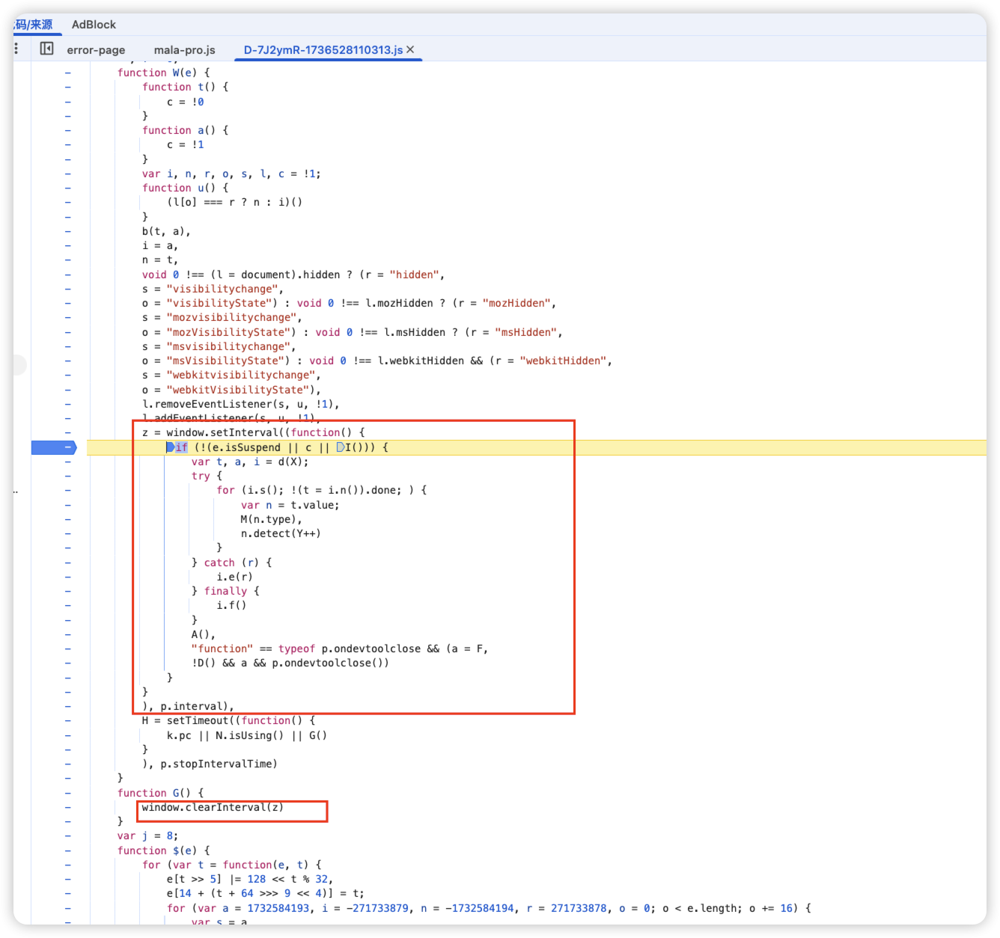

1. ### 页面禁止右键,无法进入开发者工具

    - **浏览器菜单手动打开 DevTools**

        - 显示 -> 开发者 -> 开发者工具

    - **控制台强制启用右键**

        - ```javascript
            document.oncontextmenu = null;
            // 或者直接解除所有右键限制
            document.addEventListener('contextmenu', e => e.stopPropagation(), true);
            ```

2. ### 禁止网页在开发者工具打开时自动刷新，可以尝试以下方法

    ### 1. **禁用JavaScript（最有效）**

    - 在开发者工具中按 `F1` 打开设置 → 找到 **"Disable JavaScript"** 并勾选

    - 或直接在控制台输入：

        ```javascript
        document.addEventListener('beforeunload', function(e) { e.preventDefault(); });
        ```

    ### 2. **断点拦截法**

    在 **Sources/Debugger** 面板：

    - 找到页面主JS文件，搜索 `beforeunload`/`setTimeout`/`setInterval` 相关代码
    - 在刷新相关代码行设置断点（点击行号）

    ### 3. **网络请求拦截**

    - 在 **Network** 面板勾选 **"Offline"**（模拟离线状态）
    - 或右键请求 → **Block request URL**（拦截特定刷新请求）

    ### 4. **控制台注入代码**

    在控制台执行（可能需多次尝试）：

    ```javascript
    // 阻止定时刷新
    for(let i=0; i<9999; i++) clearInterval(i);
    // 阻止页面卸载
    window.onbeforeunload = function() { return false; };
    ```

    ### 5. **修改请求头**

    在 **Network Conditions** 中：

    - 修改 `User-Agent` 为移动端标识（如 `Mozilla/5.0 (iPhone)`）
    - 部分网站会因此禁用刷新逻辑

    ### 6. 切换 tab后, js会暂停执行,

    - 全局查找 interval 参数,找到方法,打断点,在控制台,执行清除操作

    - ```
        window.clearInterval(z)
        ```

    - 
