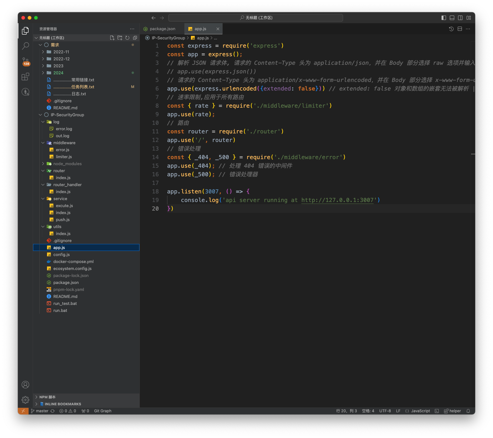

# express 项目

### 总览



### 1. app.js

```js
const express = require('express')
const app = express();
// 解析 JSON 请求体, 请求的 Content-Type 头为 application/json，并在 Body 部分选择 raw 选项并输入 JSON 格式的数据
// app.use(express.json()) 
// 请求的 Content-Type 头为 application/x-www-form-urlencoded，并在 Body 部分选择 x-www-form-urlencoded 选项，使用键值对的方式输入数据。
app.use(express.urlencoded({extended: false})) // extended: false 对象和数组的嵌套无法被解析 | extended: true 可以解析对象和数组等复杂结构
// 速率限制,应用于所有路由
const { rate } = require('./middleware/limiter') 
app.use(rate);
// 路由
const router = require('./router')
app.use('/', router)
// 错误处理
const { _404, _500 } = require('./middleware/error') 
app.use(_404); // 处理 404 错误的中间件
app.use(_500); // 错误处理器

app.listen(3007, () => {
    console.log('api server running at http://127.0.0.1:3007')
})
```

使用 post 请求,全局接口频率限制,错误处理等

### 2.路由 router.js

```js
const express = require('express')
const router = express.Router()
const handler = require('../router_handler')
const { bruteForce } = require('../middleware/limiter') 
router.post('/ip', bruteForce.prevent, handler.ip)
router.post('/test', bruteForce.prevent, handler.test)
module.exports = router
```

跟路由`/`交给 router.js 处理

先经过 IP 封禁策略,满足要求后才能进入后续处理

### 3.IP 封禁策略 limter.js

"express-brute": "^1.0.1",

"express-rate-limit": "^7.4.0",

```js
const rateLimit = require('express-rate-limit');
const ExpressBrute = require('express-brute');
const _1s = 1000
const _1min = 60 * _1s
const _1h = 60 * _1min
const _1d = 24 * _1h
const _freeRetries = 5
// 接口调用频率 5 秒内 1 次
const rate = rateLimit({
    windowMs: 5 * _1s,
    max: 1,
    message: {message: '你太快了,慢一点!'}, // 超出限制时的响应消息
});

// 超过重试次数,则封禁 (1 小时)
const store = new ExpressBrute.MemoryStore();
const bruteForce = new ExpressBrute(store, {
    freeRetries: _freeRetries,
    minWait: _1h,
    failCallback: (req, res, next, nextValidRequestDate) => {
        res.status(429).json({
            message: '冷静一下(1h)'
        });
    }
});
module.exports = {
    rate,
    bruteForce
};
```

### 4.在 router_handler 中处理后续逻辑

```js
const { password } = require('../config')
const { getIP } = require('../utils')
exports.ip = (req, res) => {
    const clientIp = getIP(req.ip)
    const { p } = req?.body
    if (p && p === password) {
        const targetIp = req?.body?.ip ?? clientIp; // 是否指定 ip
        console.log(`开始执行脚本,目标IP: ${targetIp}`);
        res.send({ message: `开始执行脚本,目标IP: ${targetIp}`, clientIp: `${clientIp}` });
    } else {
        console.log(`ip: ${clientIp} | 密码错误`);
        res.send({ message: '错误' });
    }
}

// for test
exports.test = (req, res) => {
    const clientIp = getIP(req.ip)
    const { p } = req?.body
    if (p && p === password) {
        const targetIp = req?.body?.ip ?? clientIp; // 是否指定 ip
        console.log(`test-开始执行脚本,目标IP: ${targetIp}`);
        res.send({ message: `test-开始执行脚本,目标IP: ${targetIp}`, clientIp: `${clientIp}` });
    } else {
        console.log(`test-ip: ${clientIp} | 密码错误`);
        res.send({ message: 'test-错误' });
    }
}
```

### 5.pm2 运行项目

```js
module.exports = {
    apps: [
        {
            name: 'ip',
            script: 'app.js',
            out_file: 'log/out.log',    // 标准输出日志文件
            error_file: 'log/error.log', // 错误日志文件
            log_date_format: 'YYYY-MM-DD HH:mm:ss', // 日志中时间的格式
        },
    ],
};
```

### 6.docer 部署

```yml
services:
  app:
    image: node:18  # 使用官方 Node.js 18 镜像
    volumes:
      - .:/app/5G  # 将当前目录挂载到容器的 /app/5G 目录
      - /app/5G/node_modules  # 防止本地覆盖 node_modules
      - /etc/localtime:/etc/localtime:ro # 同步本地时间
    working_dir: /app/5G  # 设置工作目录
    ports:
      - "3007:3007"  # 暴露端口
    command: sh -c "npm config set registry https://registry.npmmirror.com && npm install pm2 -g && npm install && pm2-runtime ecosystem.config.js"  # 设置 npm 源、安装 PM2、安装依赖并启动应用
    environment:
      - NODE_ENV=production
      - TZ=Asia/Shanghai
```

启动命令

```shell
docker compose up # 服务端不需要空格
```

