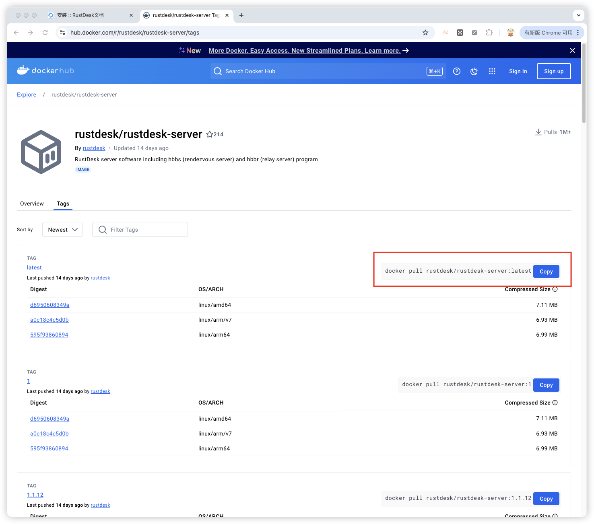
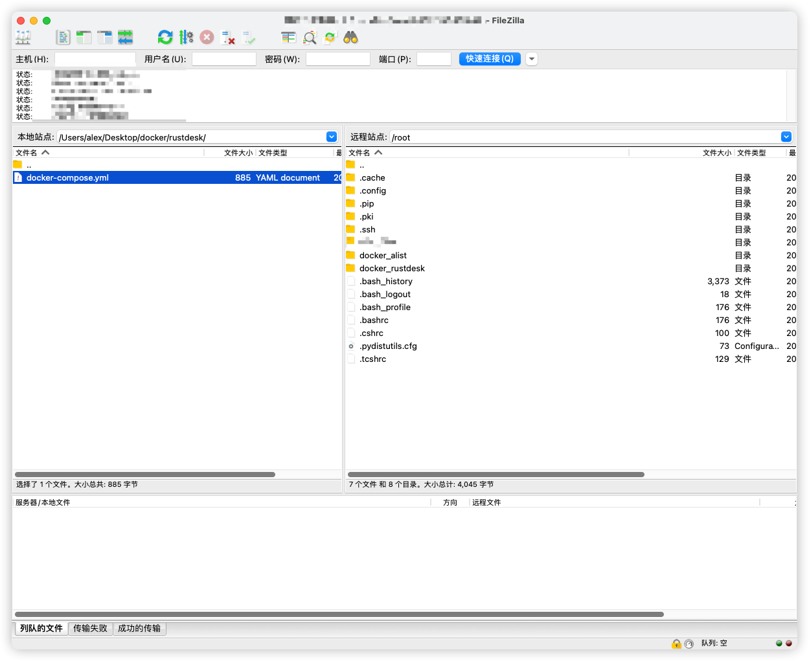
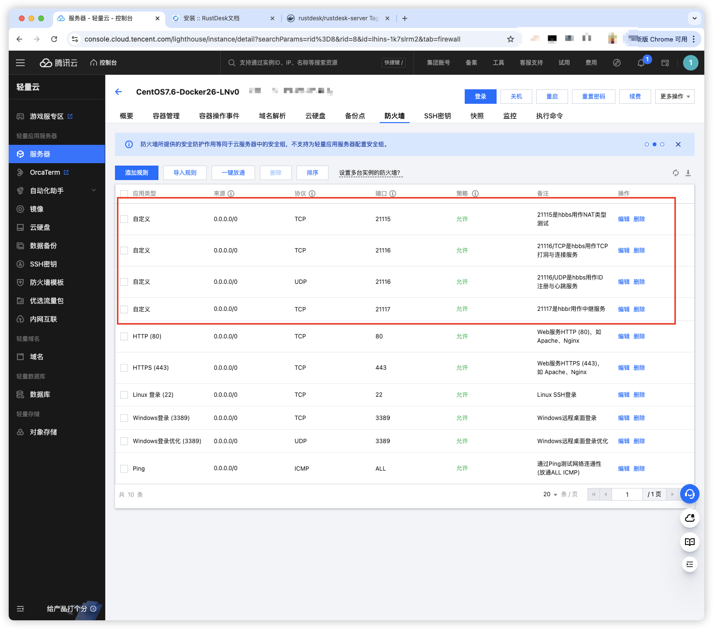
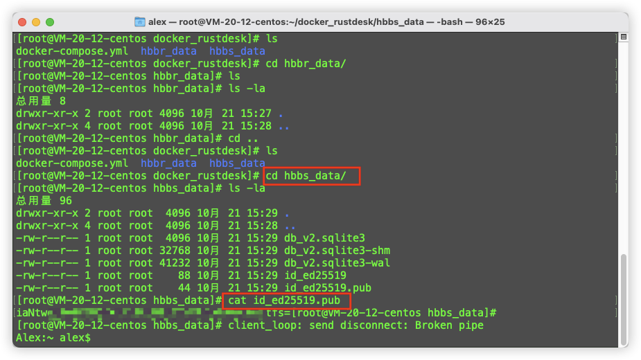
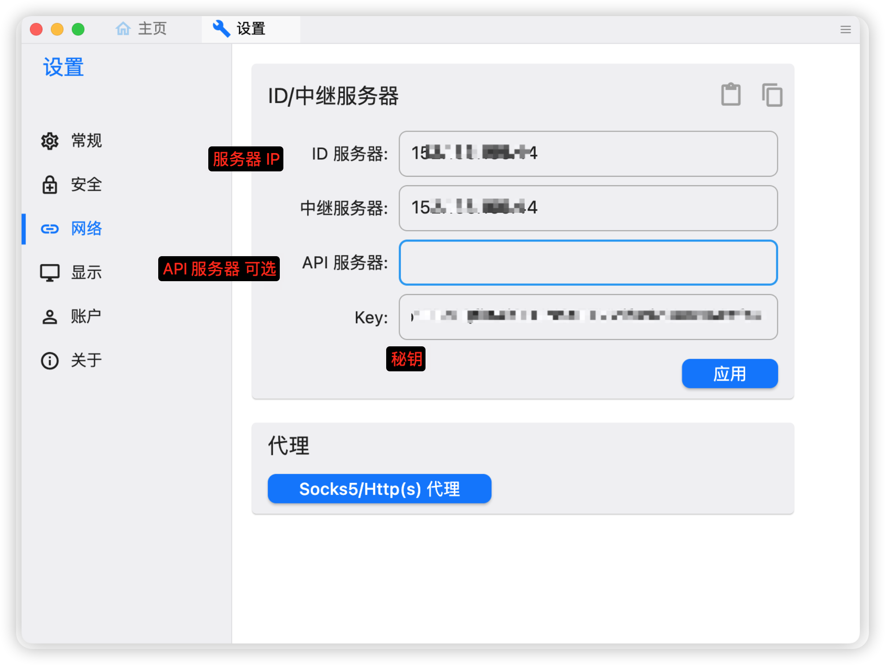

# Rustdesk 私有部署

1. 购买腾讯云服务器

    - centos7-docker26 78 元/年

2. docker 安装

    - [官方链接(中文)](https://rustdesk.com/docs/zh-cn/self-host/rustdesk-server-oss/install/)
    - 使用 docker 安装 [地址](https://hub.docker.com/r/rustdesk/rustdesk-server/tags)
    - 
    - ssh 登录腾讯云服务器后,在 home 目录下执行安装命令
        - `docker pull rustdesk/rustdesk-server:latest`
        - `docker images` 检查是否安装

3. 创建目录和docker-compose.yml文件

    - 在 home 目录下,创建 docker_rustdesk

    - 进入后,创建 hbbr_data 和 hbbs_data 目录

        - hbbs - RustDesk ID注册服务器
        - hbbr - RustDesk 中继服务器

    - 上传docker-compose.yml文件到 /root/docker_rustdesk

    - 

    - docker-compose.yml文件内容

    - ```yml
        
        networks:
          rustdesk-net:
            external: false
        
        services:
          hbbs:
            container_name: hbbs
            ports:
              - 21115:21115
              - 21116:21116 # 自定义 hbbs 映射端口
              - 21116:21116/udp # 自定义 hbbs 映射端口
            image: rustdesk/rustdesk-server
            command: hbbs 
            volumes:
              - /root/docker_rustdesk/hbbs_data:/root # 自定义挂载目录
            networks:
              - rustdesk-net
            depends_on:
              - hbbr
            restart: unless-stopped
            deploy:
              resources:
                limits:
                  memory: 64M
        
          hbbr:
            container_name: hbbr
            ports:
              - 21117:21117 # 自定义 hbbr 映射端口
            image: rustdesk/rustdesk-server
            command: hbbr
            volumes:
              - /root/docker_rustdesk/hbbr_data:/root # 自定义挂载目录
            networks:
              - rustdesk-net
            restart: unless-stopped
            deploy:
              resources:
                limits:
                  memory: 64M
        
        ```

4. 启动服务

    - ```shell
        docker compose up -d
        ```

5. 开启端口

    - 
    - TCP(**21115, 21116, 21117**)
    - UDP(**21116**)
    - 21115是hbbs用作NAT类型测试，
    - 21116/UDP是hbbs用作ID注册与心跳服务，21116/TCP是hbbs用作TCP打洞与连接服务，
    - 21117是hbbr用作中继服务
    - 21118和21119是为了支持网页客户端。如果您不需要网页客户端（21118，21119）支持，对应端口可以不开
    - 

6. 客户端配置

    - 进入 hbbs_data 目录
    - `cat id_ed25519.pub` 获取秘钥
    - 
    - 客户端配置
    - 