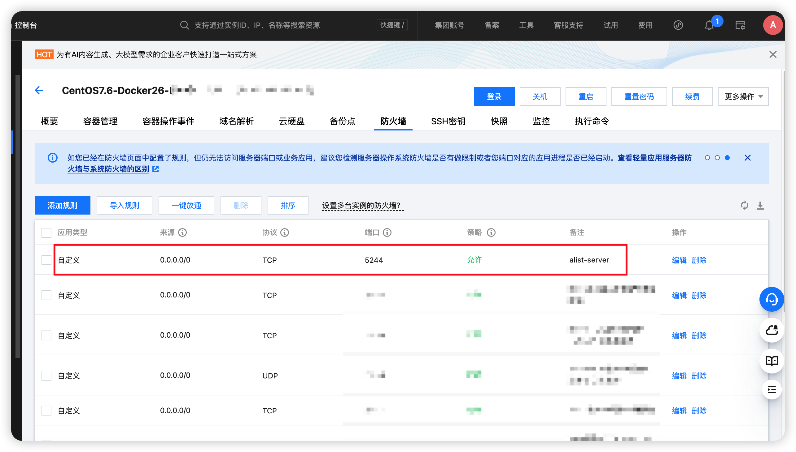
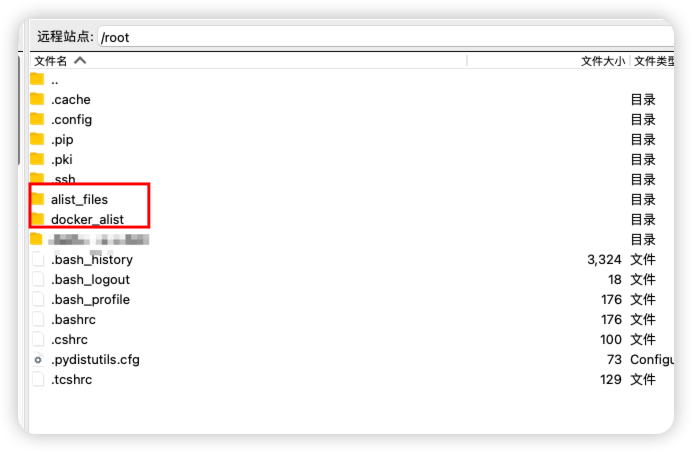
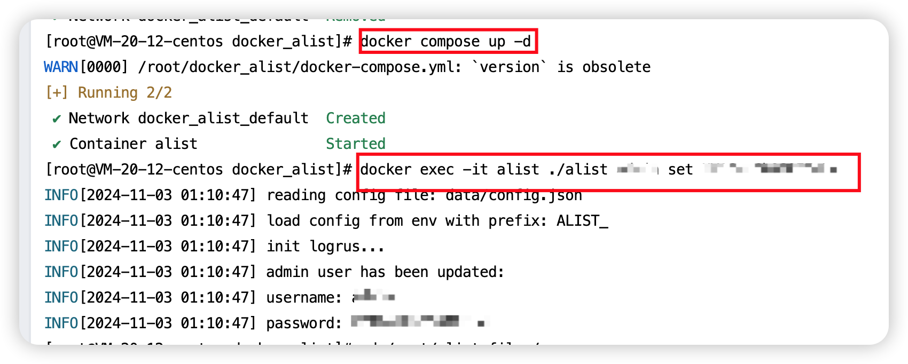
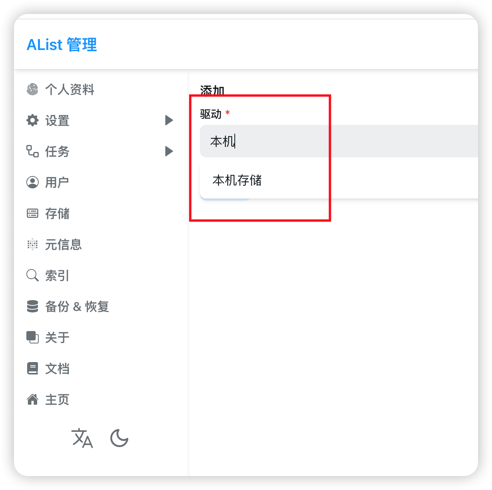
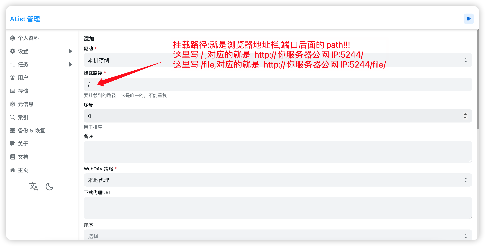
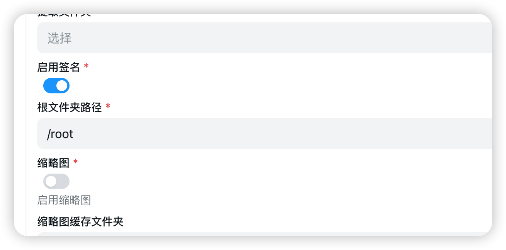
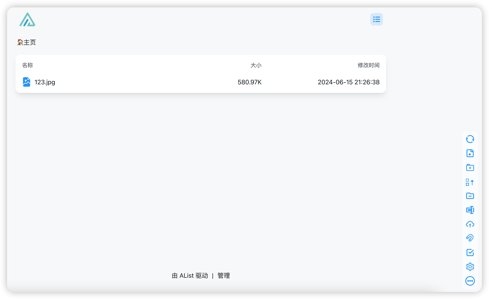
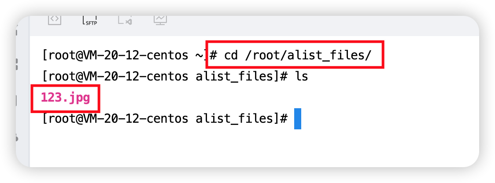

# 使用 AList docker部署私有云盘(腾讯云)

## 1. 准备工作

- 购买腾讯云服务器 (我这里使用轻量服务器 79 元/年)
- 防火墙开启 `5244` 端口,因为 AList 使用该端口(也可以自定义)
    - 
- 创建两个目录
    - /root/docker_alist,用于映射 AList 配置
    - /root/alist_files,用于映射容器文件到磁盘
    - 

## 2. docker 部署 AList

- 这里使用 docker-compose 部署,[参考文档](https://alist.nn.ci/zh/guide/install/docker.html#docker-compose)

- 这里对上面问的中的`docker-compose.yml`文件略微改动,添加了文件目录映射,具体如下:

    - ```yaml
        version: '3.3'
        services:
            alist:
                image: 'xhofe/alist:latest'
                container_name: alist
                volumes:
                    - '/root/docker_alist/data:/opt/alist/data' # 宿主机自定义目录:容器内 root 目录
                    - '/root/alist_files/:/root' # 宿主机自定义目录:容器内 root 目录, 用于查看具体文件
                ports:
                    - '5244:5244'
                environment:
                    - PUID=0
                    - PGID=0
                    - UMASK=022
                restart: unless-stopped
        
        ```

- 执行部署脚本

    - `cd /root/docker_alist` # 进入目录

    - 启动 docker 服务

        - ```shell
            docker compose up -d
            ```

    - 设置管理员账户和密码

        - ```shell
            # 随机生成一个密码
            docker exec -it alist ./alist admin random
            # 手动设置一个密码,`NEW_PASSWORD`是指你需要设置的密码
            docker exec -it alist ./alist admin set NEW_PASSWORD
            ```

        - 

    - 注意: `docker compose down` 以后,需要重新执行上面的 `设置管理员账户和密码` 步骤!
    
    - 注意:
    
        -  `docker compose down` 以后,如果没有配置上面的 映射`'/root/alist_files/:/root'`你会发现你之前上传的文件就没有了.(这也是为什么要加这个配置);
        -  如果添加了这个映射再次启动服务 `docker compose up -d`你会发现之前的文件还在!😄
    
        

## 3. 配置使用

- 访问地址: http:你的服务器公网IP:5244,登录刚刚的账户和密码
- 
- 点击底部管理按钮(如果提示报错先不用管,因为还没配置好)
- 左侧存储按钮->驱动选择"`本机存储`" (手动输入也可以),一定是本机存储!!!!!不要写成本地存储!!!
    - 
- 配置挂载路径,配置 `/`
    - 
- WebDAV 策略,`不用改`
- 启用签名 (开着吧)
    - 关闭:分享文件连接不带签名,任何人可以访问
    - 开启:分享的文件链接带签名,签名正确才可以访问
- 根文件夹路径,配置 `/root`
    - 这里的 /root 是容器内的 root 目录,不是宿主机的目录!
    - 如果想配置其他目录,也可以,但是我还没现就怎么改,请自行查阅他人资料
    - 
- 缩略图 `关闭` 
- 点击底部 `添加` 按钮

## 4. 验证

- 访问http:你的服务器公网IP:5244
- 不会报错,而且是空目录
- 右侧按钮,上传一个文件,比如一张 123.jpeg 的图片
    - 
- 有下载,分享等功能,分享的链接是带签名的!
- 注意,因为 docker-compose.yml 配置文件中对目录进行了映射,所以在宿主机的`/root/alist_files`中能看上传的文件
    - `'/root/alist_files/:/root' # 宿主机自定义目录:容器内 root 目录, 用于查看具体文件`
    - 

## 5. 一定开启 2FA!!!

- 在 "用户" 界面,开启两步验证,即便其他人知道你的用户名密码,也需要 `Authenticator`中的验证码才可以访问!
- 开启两步两步验证前请一定牢记自己的秘钥!!!

