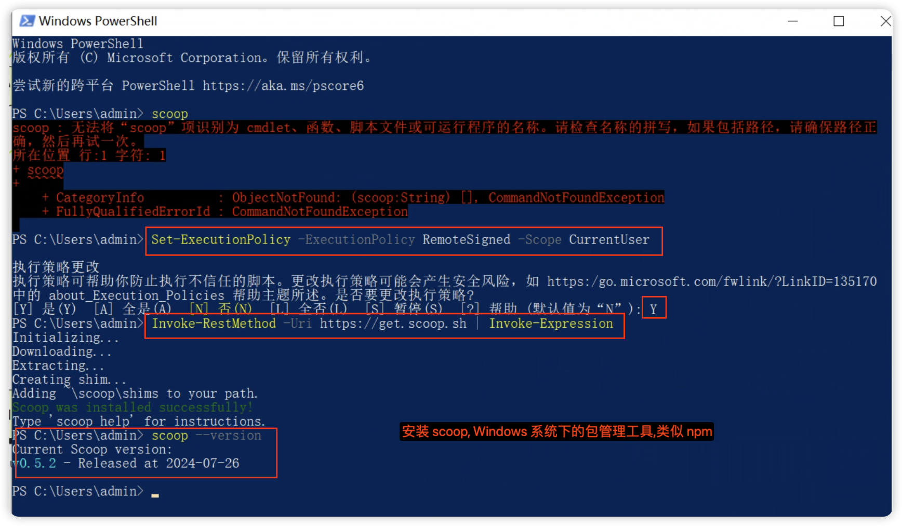

# GitHub 使用本地代理

---

1. 本地必须配置好可用代理,并且开启端口访问

    - 
    - 我本机开启的是 7890 端口

2. Mac 系统

    - ```bash
        cd ~/.ssh # 进入用户目录的 .ssh 目录,如果没有就创建
        vi config # 对 config 进行编辑
        ```

    - 添加如下配置

    - ```bash
        Host github.com
              HostkeyAlgorithms +ssh-rsa
              PubkeyAcceptedAlgorithms +ssh-rsa
              ProxyCommand nc -v -x 127.0.0.1:7890 %h %p
        ```

        

    - 主要是这一行 `ProxyCommand nc -v -x 127.0.0.1:7890 %h %p`

3. Windows 系统

    - 本地开启代理,并确保可用,我这里的端口是 **7897**

        - 

    - Windows 比较特殊,需提前安装 `connect`

        - 安装包管理工具 scoop [官网](https://scoop.sh/)

        - 安装命令

        - ```bash
            Set-ExecutionPolicy -ExecutionPolicy RemoteSigned -Scope CurrentUser
            Invoke-RestMethod -Uri https://get.scoop.sh | Invoke-Expression
            ```

        - 

        - 使用 scoop 安装 connect

        - ```bash
            scoop install connect
            ```

    - 开始配置

        - ```bash
            cd ~/.ssh # 进入用户目录的 .ssh 目录,如果没有就创建
            vi config # 对 config 进行编辑
            ```

        - ```bash
            Host github.com
                HostName github.com
                User git
                IdentityFile ~/.ssh/id_xxx
                ProxyCommand connect -S 127.0.0.1:7897 %h %p
            ```

        - 主要是这一行 `ProxyCommand connect -S 127.0.0.1:7897 %h %p`

4. 其他情况 (比如部署机器,已绑定ssh key,需特殊指定 GitHub 项目地址)

- ```
    # 其他情况,比如部署机器,已绑定ssh key,需特殊指定 GitHub 项目地址
    Host project.github.com
        HostName github.com
        User git
        IdentityFile ~/.ssh/id_project
        ProxyCommand connect -S 127.0.0.1:7897 %h %p
    ```

- ```bash
    # 在 ssh clone 的时候使用
    # 原地址: git@github.com:yourname/project_name.git
    # 要改成: git@project.github.com:yourname/project_name.git
    # 修改后在 clone 即可
    git clone git@project.github.com:yourname/project_name.git
    ```

- enjoy!😄
