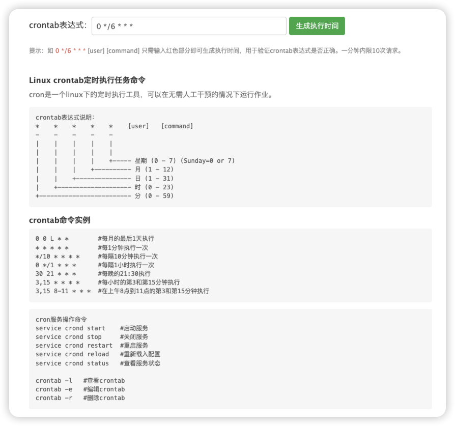

- # crontab 定时任务

---

*背景: 需4 小时重启一次 pm2*

1. 创建脚本

    - 路径: /root/restart_pm2.sh

    - 内容

        - ```bash
            #!/bin/bash
            source ~/.bashrc
            你机器的pm2路径 restart all > /tmp/pm2_restart.log 2>&1
            ```

        - 查找 `pm2`指令: `which pm2`会输出你的 pm2 路径,例如

        - ```bash
            #!/bin/bash
            source ~/.bashrc
            /root/.nvm/versions/node/v22.16.0/bin/pm2 restart all > /tmp/pm2_restart.log 2>&1
            ```

        - 添加可执行权限 `chmod +x ./restart_pm2.sh `

2. 配置 crontab

    - 输入指令: `crontab-e`,开始编辑,输入如下内容:

    - ```
        0 */4 * * * /root/restart_pm2.sh
        ```

    - 每隔 4 小时执行 bash 脚本

3. [在线工具](https://www.iamwawa.cn/crontab.html) [在线工具](https://www.bejson.com/othertools/cron/)

    - 
