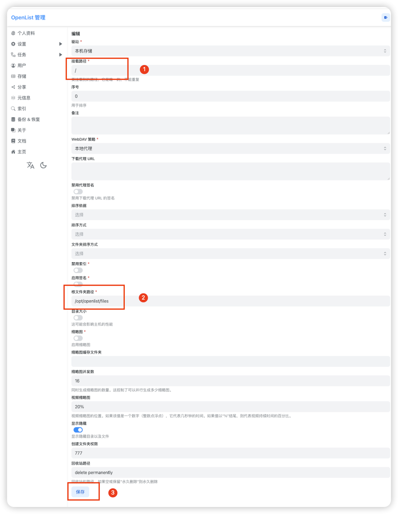

# 使用Docker 部署 OpenList

2025-10-17 openlist是替代 AList 的开源版本!

[文档地址](https://doc.oplist.org/guide/installation/docker)

1. 创建目录

    - 创建 docker_openlist;
    - 进入docker_openlist, 创建data和files目录;

2. 修改权限

    - ```sh
        chown -R 1001:1001 data files
        ```

    - > - 4.1版本之后,使用 useradd 增加了用户 openlist（UID 1001）和组 openlist（GID 1001），并使用该用户运行 openlist server。
        > - 所以,需要手动处理映射的目录的权限问题，确保容器内的 openlist(1001) 用户有权限访问映射的目录。
        > - 这个1001是vps 中用户openlist的ID,是 OpenList 开发团队人为指定的一个固定数字
        > - 避免与系统用户冲突（系统用户通常使用 0-999）
        > - 避免与宿主机常见用户冲突（很多 Linux 系统第一个普通用户是 1000）
        > - 1001 是一个安全的、不容易冲突的数字, root 用户的 UID 是 0, 普通用户通常从 1000 开始编号
        > - 1001:1001 对应 UID:GID

3. 配置 compose.yml 文件

    - ```yaml
        # docker-compose.yml
        services:
          openlist:
            image: 'openlistteam/openlist:latest'
            container_name: openlist
            volumes:
              # OpenList 配置和数据库文件
              - './data:/opt/openlist/data'
              # 用户上传的文件存储目录（挂载到宿主机）
              - './files:/opt/openlist/files'
            ports:
              - '5244:5244'
            environment:
              - UMASK=022
              - TZ=Asia/Shanghai
            restart: unless-stopped
        ```

    - `./files:/opt/openlist/files`,在 files目录下就能看到上传的文件!

4. 启动docker

    - ```sh
        docker compose pull
        docker compose up -d
        ```

5. 查看信息

    - ```sh
        # 在日志中看到密码
        docker logs openlist
        ```

    - 非首次运行,可以用下面的

        ```
        # 重新随机生成密码
        docker exec -it openlist ./openlist admin random
        
        # 手动设置密码为 `NEW_PASSWORD`（替换为您要设置的密码）
        docker exec -it openlist ./openlist admin set NEW_PASSWORD
        ```

6. 用户设置挂载路径

    - 
