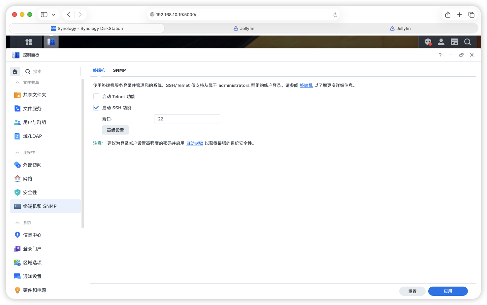
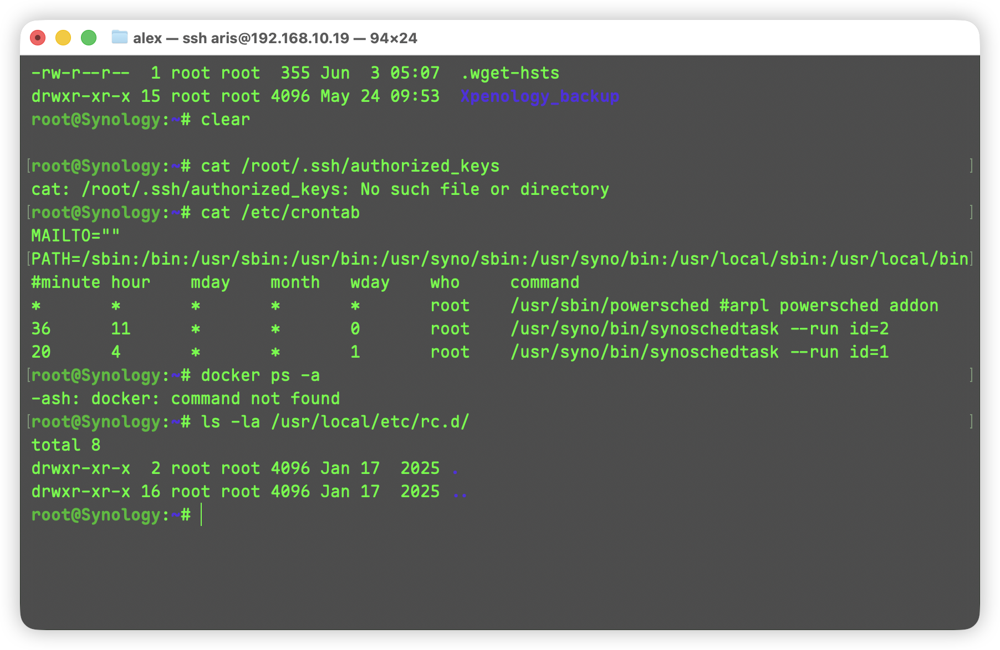
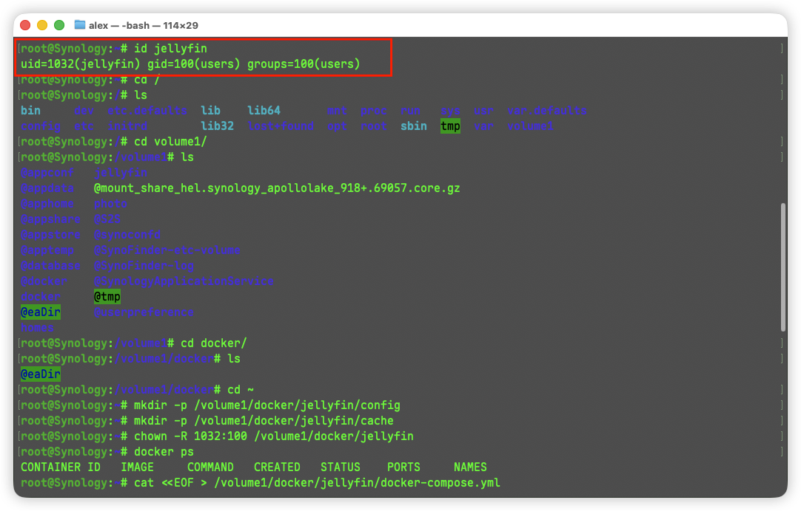
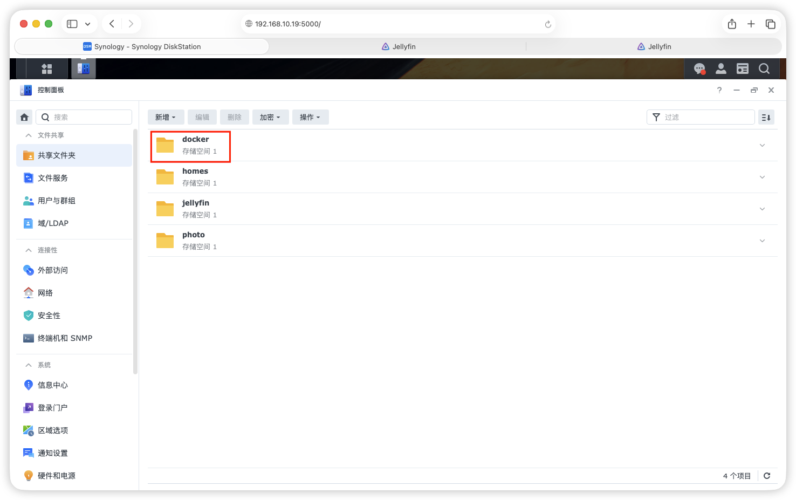
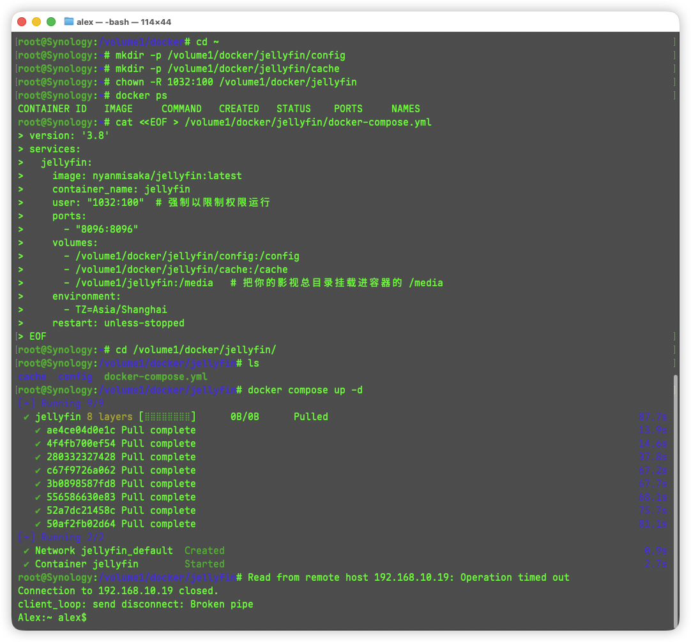
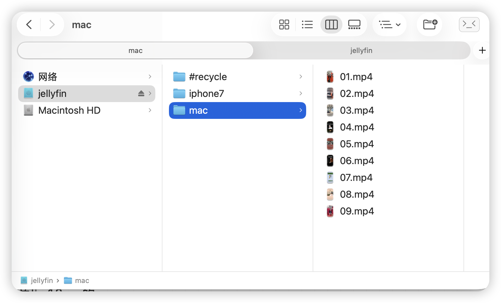
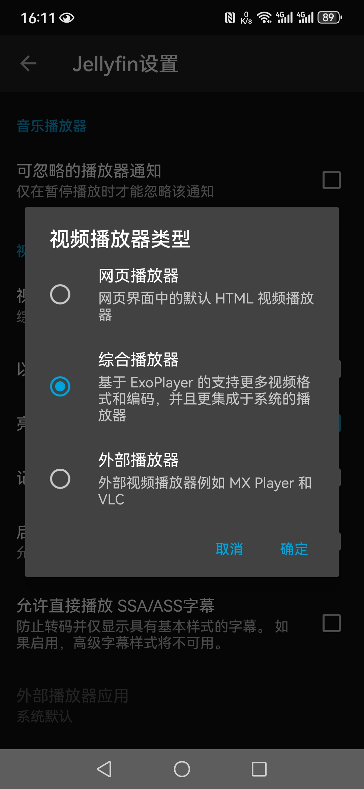

# NAS使用Docker部署Jellyfin影音项目

> ### Jellyfin (100% 免费的 GitHub 开源影音服务器)
>
> 如果你想要一个完全免费、没有任何限制的开源解决方案，**Jellyfin** 是目前唯一的、也是最好的选择。它是曾经的闭源软件 Emby 的开源分支，目前在 GitHub 上拥有极高的活跃度。
>
> - **GitHub 地址:** [https://github.com/jellyfin/jellyfin](https://www.google.com/url?sa=E&q=https%3A%2F%2Fgithub.com%2Fjellyfin%2Fjellyfin)
> - **完全免费：** 没有收费的高级会员（区别于 Plex 和 Emby）。
> - **免费硬件解码：** 只要你的群晖 CPU 带核心显卡（比如常见的 Intel J4125/N5105 等），就可以免费开启硬件转码。这意味着哪怕你的手机不支持某种视频格式，NAS 也会自动将其转换成手机能播的格式，且不卡顿。
> - **全平台客户端：** 网页端（电脑）、iOS、Android、Android TV、Apple TV 都有官方或第三方的免费客户端。
> - **海报墙功能：** 会自动识别你的视频文件名，从网上下载精美的电影海报、演员表、剧情简介。

1. 网页登录nas机器并开启ssh访问:

- http://192.168.10.19:5000
- 控制面板->终端机和SNMP->启动SSH功能->端口22->引用
- 

2. nas安全隐私检查:

- mac终端SSH登录 ssh 你的群晖登录账号@192.168.10.19

- 获取root权限 sudo -i

- 如果命令提示符从 ~$ 变成了 ~#（并且前面带有 root@），说明你现在已经拿到了这台机器的最高控制权。

- ```
    # 检查 SSH 免密登录后门 (最危险)
    cat /root/.ssh/authorized_keys
    # 检查底层的计划任务 (Cron)
    cat /etc/crontab
    # 检查有没有运行隐藏的 Docker 容器
    docker ps -a
    # 检查开机启动项
    ls -la /usr/local/etc/rc.d/
    ```

- 

- "**机器非常干净，没有任何被留置后门的迹象。**"

3. 安装 Container Manager (Docker)：

    - .png)
    - .png)
    - 

4. 创建共享文件夹

    - 控制面板 - 共享文件夹

    - .png)

    - > - **“在网上邻居隐藏此共享文件夹” (不勾选)：**
        >     保持不勾选。这样你以后在 Mac 上通过 Finder（访达）连接 NAS 时，能直接看到这个文件夹，方便你把电脑上的测试视频拖拽进去。
        > - **“对没有权限的用户隐藏子文件夹和文件” (不勾选)：**
        >     保持不勾选。除非你给家里其他人开了独立的没有管理员权限的 NAS 账号，否则这个选项只会增加权限管理的复杂度。
        > - **“启用回收站” (✅ 推荐勾选)：**
        >     因为你要放手机照片和监控等重要数据，勾选它是给自己留一颗“后悔药”。如果不小心误删了视频，还能从里面找回来。
        >     *子选项“只允许管理者访问”也勾上，这很好，防止别人乱动回收站。*
        >     *(注：开启回收站后，这个文件夹里会多出一个隐藏的 #recycle 文件夹。后续在 Jellyfin 里添加媒体库时，记得别把这个回收站文件夹选进去就行。)*

    - 点击右下角的 **“下一步”**。

    - **加密页面：** 遇到提示是否加密，**千万不要加密**。J1900 的 CPU 性能极弱，如果视频文件夹加密，读写速度会大打折扣，直接跳过。

    - **高级设置：** 都不用管，直接下一步。

    - **用户权限确认（最后一步）：** 它会弹出一个表格让你分配权限。确保你**当前登录的这个管理员账号**后面的 **“可读写 (Read/Write)”** 框是勾上的！然后点“应用”。

5. 创建Jellyfin账号

    - #### 创建专用普通用户

        1. 在群晖网页端，打开 **“控制面板”** -> **“用户与群组”** -> 点击 **“新增”**。
        2. **名称：** 取名叫 jellyfin_runner (或者随便你喜欢的名字)，密码随便设置一个强密码（这个密码其实永远用不到，因为我们不会用它登录系统）。
        3. **加入群组：** 只勾选 users（普通用户组），**千万不要勾** administrators。
        4. **分配共享文件夹权限：** 这一步最关键。你只需要给两个文件夹打勾 **“可读写 (Read/Write)”**：
            - docker (它需要在这个文件夹里写配置文件)
            - jellyfin (它需要在这个文件夹里读取视频，写入海报图)
            - *其他的私密文件夹（如 photo、homes 等）统统勾选“禁止访问”！*
        5. **空间配额 / 应用程序权限：** 全部跳过或保持默认拒绝。一路“下一步”完成创建。

    - #### 获取该用户的底层 UID 和 GID (终端操作)

        在 Linux 系统里，Docker 认的不是用户名，而是底层的 UID (用户ID) 和 GID (组ID)。

    - .png)

    - .png)

    - 在终端查询 uid 和gid

    - 

    - 拿到 uid=1032 和 gid=100

6. 创建目录赋予权限

    - 之前的container manager 安装好了以后,共享文件夹

    - 

    - ### 第一步：创建配置目录并赋予专属权限

        - ```
            # 1. 创建 Jellyfin 需要的配置和缓存文件夹
            # 这里的 volume1 就是 挂载的12T硬盘
            mkdir -p /volume1/docker/jellyfin/config
            mkdir -p /volume1/docker/jellyfin/cache
            
            # 2. 将这些文件夹的底层所有权，强行移交给咱们刚建的 jellyfin 用户 (1032:100)
            chown -R 1032:100 /volume1/docker/jellyfin
            ```

    - ### 第二步：生成 docker-compose.yml 部署文件

        - ```
            cat <<EOF > /volume1/docker/jellyfin/docker-compose.yml
            version: '3.8'
            services:
              jellyfin:
                image: nyanmisaka/jellyfin:latest
                container_name: jellyfin
                user: "1032:100"  # 强制以限制权限运行
                ports:
                  - "8096:8096"
                volumes:
                  - /volume1/docker/jellyfin/config:/config
                  - /volume1/docker/jellyfin/cache:/cache
                  - /volume1/jellyfin:/media   # 把你的影视总目录挂载进容器的 /media
                environment:
                  - TZ=Asia/Shanghai
                restart: unless-stopped
            EOF
            ```

    - ### 第三步：点火起飞！

        - ```
            cd /volume1/docker/jellyfin
            docker compose up -d
            ```

        - 

7. 初始化配置向导

    - 浏览器访问 http://192.168.10.19:8096/web/index.html
    - 设置语言,设置账号(这个账号的Jellyfin的账号不是nas账号)
    - `关闭解码`!!!
        - 进入后先去 头像->控制台->播放->转码->硬件加速->`无`
            - 其他的默认配置就好,不用管
        - 用户->点击刚创建的用户->媒体播放->取消勾选下面3项->保存
            - 取消勾选 `允许播放需要转码的视频`
            - 取消勾选 `允许播放需转换但无需重新编码的视频`
            - 取消勾选 `强制对直播电视等远程媒体源进行转码`

8. 上传视频资源

    - 设计多目录层级,所以在Jellyfin的跟目录下创建多个目录

    - 当前创建`mac`目录,测试是否能访问,随便拷贝一些资源到这里

        - 打开 Finder -> cmd + K -> smb://192.168.10.19
        - 输入 用户名 -> 密码 -> 连接 -> `双击`选择 `Jellyfin`目录
        - 这就挂载到了Finder中,然后拖拽一些视频资源过去
        - 

        

9. 添加媒体库

    - 访问 http://192.168.10.19:8096

    - 登录刚刚创建的Jellyfin账户

    - 添加媒体库->"选择家庭视频和照片"->显示名称自定义(我这里是MacBook Pro)

    - .png)

    - .png)

    - 文件夹选择 `/media`->选 `mac`

    - .png)

    - .png)

    - ```
        # docker-compose.yml 挂载 media 到 宿主机 /volume1/jellyfin
        - /volume1/jellyfin:/media
        ```

    - 剩下的配置不用管,直接点击确定即可,应该就可以看到mac目录下的视频文件了.

10. 手机端配置

    - **官方 Jellyfin App**
    - 配置: http://192.168.10.19:8096
    - 登录在网页创建的Jellyfin 账户
    - 头像->客户端设置->视频播放器类型-选择`综合播放器` (基于ExoPlayer)
    - 

11. iOS客户端配置

    - 下载 `infuse` 或者其他客户端
    - 设置 -> 新增文件来源 -> 已存储的共享-> 添加 -> 媒体服务器-> 添加 Jellyfin
        - **名称 (Name)：** 随便填，比如“我的群晖”或者“Macbook Pro视频”。
        - **地址 (Address / URL)：** 输入 **http://192.168.10.19:8096** （千万别忘了加 http:// 和后边的 :8096 端口号）。
        - **用户名 (Username)：** 输入你当时在 Jellyfin 网页端向导里设置的那个**业务登录账号**（千万别填底层的 1032 那个号，也别填群晖的账号）。
        - **密码 (Password)：** 输入 Jellyfin 的登录密码
        - 点击新增按钮

12. 为什么之前创建的NAS Jellyfin账号没有使用?

    - 你之所以觉得“好像没用到它”，是因为**它是一个彻头彻尾的“幕后打工人”，永远不会在任何登录界面上露脸。**

        咱们用**“操作系统层”**和**“应用业务层”**的概念一拆解，你就彻底明白了：

        ### 🧱 第一层：NAS 系统里的 jellyfin 账号 (UID=1032)

        - **它的角色：** 它是 Linux 底层的一个 **Daemon/Service Account（服务账号）**。
        - **它的工作：** 替 Docker 容器去硬盘上干苦力。当你在手机上看电影时，是这个账号在底层负责把 01.mp4 从硬盘里读出来；当系统需要生成海报时，是这个账号负责把图片写进硬盘里。
        - **为什么觉得没用到：** 因为我们没给它分配任何登录群晖桌面的权限（连密码都不用管），它是一个纯粹的“无头账号（Headless Account）”，默默在后台运行。

        ### 🖥️ 第二层：Jellyfin 网页里的账号 (你刚登录用的那个)

        - **它的角色：** 它是跑在 Jellyfin 这个软件内部的 **Application Account（业务账号）**。
        - **它的工作：** 存在 Jellyfin 自己的 SQLite 数据库里。用来记录你看视频的进度、保存你的密码、管理你的媒体库界面。
        - **可见性：** 只有在 Jellyfin 的网页或手机 App 里，你才需要输入这个账号。

        ### 🛡️ 如果当初不用这个底层账号，会发生什么？（安全科普）

        如果你当初没建这个 1032 账号，并在 Docker 代码里去掉 user: "1032:100" 这一行，Jellyfin 也会照样运行，但**性质就完全变了**：

        1. **权限失控 (Root 运行)：** Docker 容器默认会以最高权限的 root 身份运行。
        2. **文件所有权污染：** 以后 Jellyfin 自动下载的每一张电影海报、每一个 NFO 配置文件，在 Linux 底层的拥有者全都会变成 root。当你某天想在 Mac 上通过网络删掉一张下错的海报时，系统会无情地弹窗：*“您没有权限删除此文件”*（因为你的 Mac 登录的是普通账号 aris，删不掉 root 的东西），极其折磨人。
        3. **巨大的安全隐患：** 假设有一天 Jellyfin 爆出了漏洞，黑客通过网页攻破了你的播放器。如果它是 root 运行的，黑客就能直接顺着网线“穿透”容器，看到甚至删掉你群晖里那些绝密的 photo 和备份文件夹！

13. 

14. 的

15. 