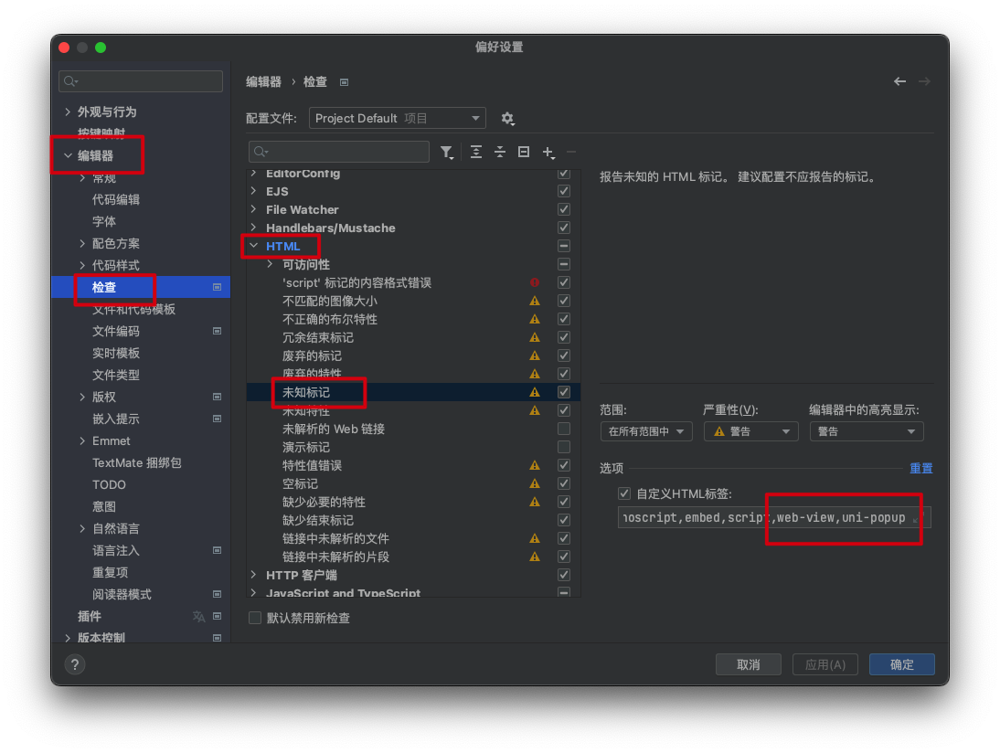

# webstorm - 不识别HTML标签 (uni-app)


参考地址:https://blog.csdn.net/weixin_44872995/article/details/105541806

uni-ui的标签在webstorm中无法识别,提示警告

例如

```html
<uni-popup></uni-popup>
<web-view></web-view>
```


解决方案: Preferences-Editor-Inspections-HTML

