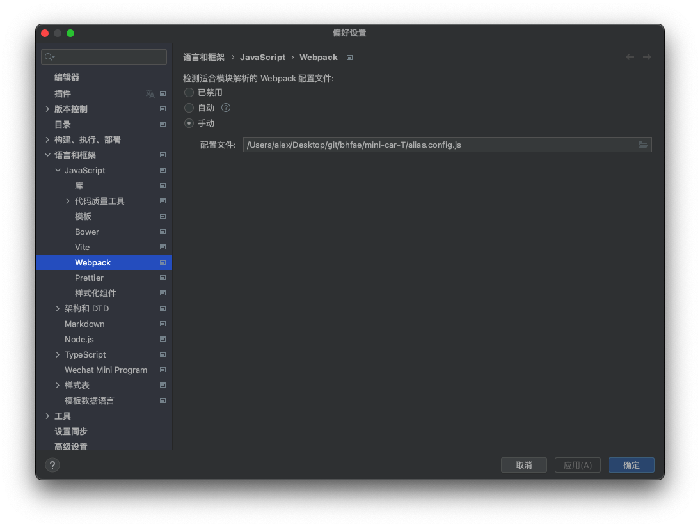

# webstorm - uini-app识别@路径

参考地址:https://blog.tcs-y.com/2020/04/26/uni-app-vue-webstorm/

备用方法:

在项目根目录创建alias.config.js文件,如下

```javascript
/**
 * 本文件对项目无任何作用，仅作为 WebStorm 识别别名用
 * 进入 WebStorm preferences -> Language & Framework -> JavaScript -> Webpack，选择这个文件即可
 * */
const resolve = dir => require('path').join(__dirname, dir);
module.exports = {
    resolve: {
        alias: {
            '@': resolve('src')
        }
    }
};
```

然后在偏好设置中

> preferences > Languages & Frameworkes > JavaScript > Webpack中的webpack configuration file设置为alias.config.js，

然后点击apply，再看main.js，很好，识别了，可以链接过去了。

