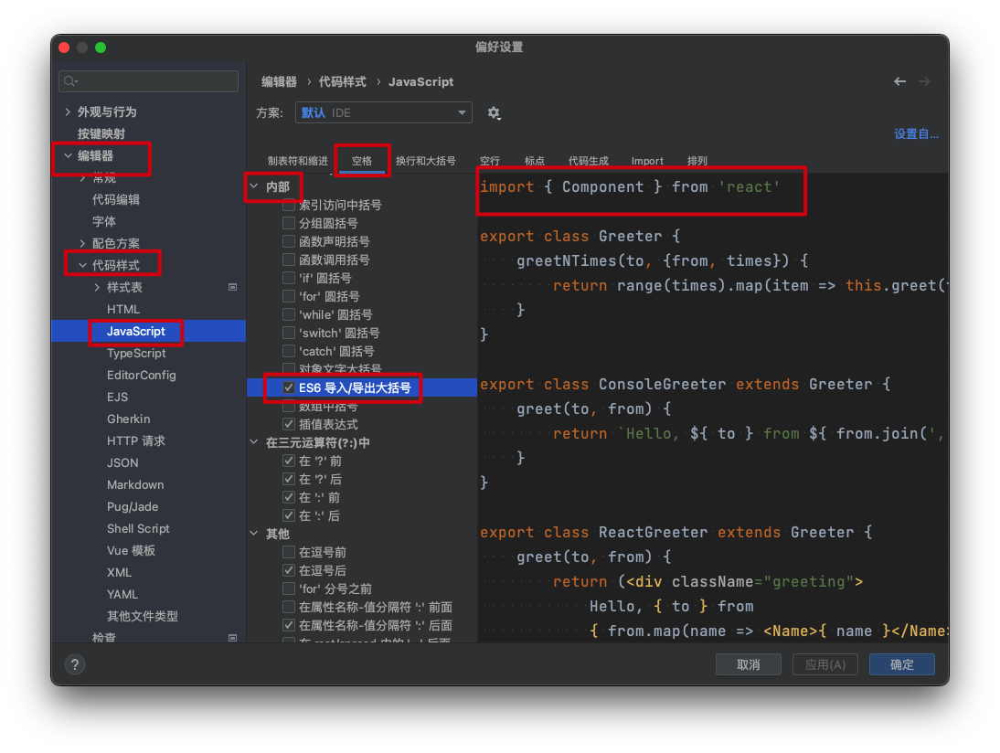

# webstorm - uni-app eslint配置

参考地址:https://blog.csdn.net/weixin_44872995/article/details/105541806

(其他配置咱为用到,可以参考一下)

背景: import 属性左右两侧需要添加空格 

```javascript
import {ref} from "vue";
改成
import { ref } from "vue";
```



