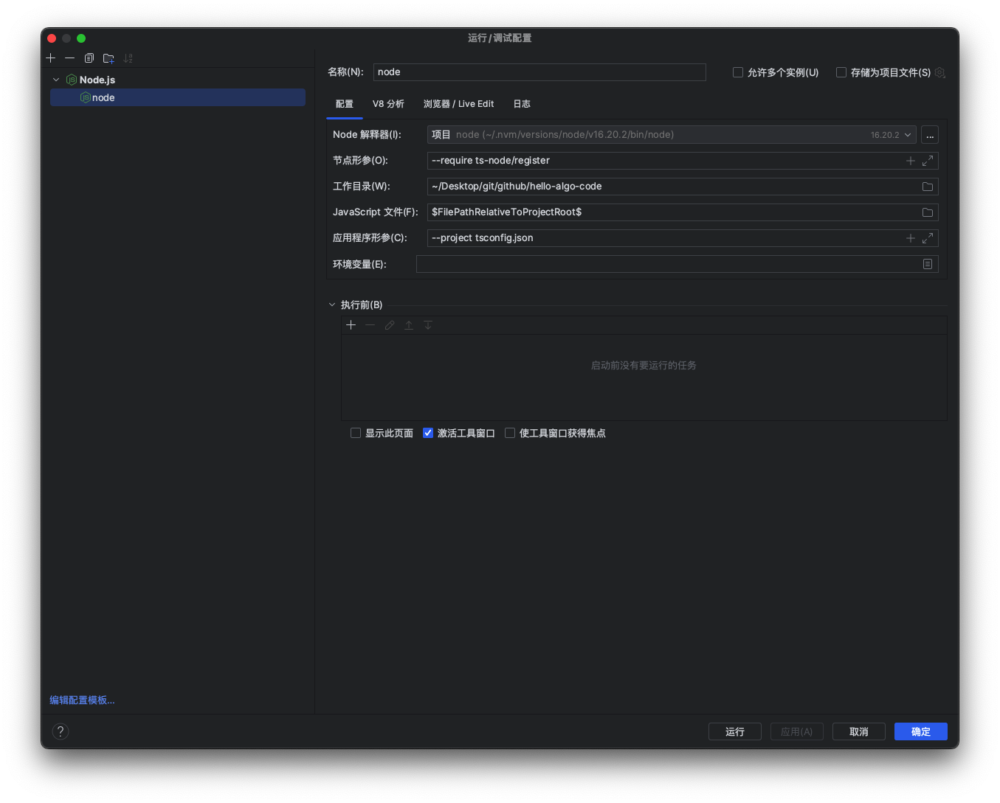

# webstorm调试Typescript

## 1. 安装依赖

```sh
pnpm i install typescript ts-node -D
```


## 2. 配置模板

- 选择 右上角 add configuration
- 选择templates下的node.js
- 在Node parameters 中添加 --require ts-node/register
- 在Working directory 中指定项目根目录作为作用空间
- 在JavaScript Files中指定要调试的宏命名：$FilePathRelativeToProjectRoot$
- Applicaiton parameters，可以指定运行参数 --project tsconfig.json

